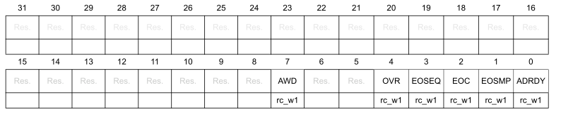
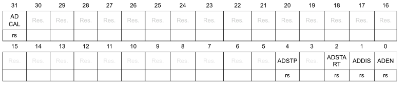

# Регистр настройки модуля АЦП (ADC)

## Регистр статуса АЦП (ADC_ISR)

Смещение адреса: `0x00`

Значение после сброса: `0x0000 0000`

Биты 31:8  Зарезервированы

Бит 7 `AWD`: статус аналогового-компаратора

* Бит устанавливается аппаратным способом, когда преобразованное напряжение пересекает значения, загруженные в
регистры ADC_LTR и ADC_HTR. Бит очищается программно, записывая в него
  * `0`: Событие аналогового компаратора не произошло (или флаг события уже был проверен и сброшен программно)
  * `1`: Произошло событие аналогового компаратора

Биты 6:5 Зарезервированы

Бит 4 `OVR`: статус переполнения регистра АЦП

* Бит устанавливается аппаратно при переполнении,это означает, что новое преобразование завершено, в то время как флаг EOC уже установлен. Флаг очищается программно, записывая в него 1.
  * `0`: Переполнения не произошло (или флаг события уже был проверен и сброшен программно)
  * `1`: Произошло переполнение

Бит 3 `EOSEQ`: статус преобразования последовательности каналов АЦП

* Бит устанавливается аппаратно в конце преобразования выбранных последовательности каналов. Флаг очищается программно, записывая в него 1.
  * `0`: Последовательность преобразования не завершена (или флаг события уже был проверен и сброшен программно)
  * `1`: Последовательность преобразования завершена

Бит 2 `EOC`: статус окончания преобразования АЦП

* Бит устанавливается аппаратно в конце каждого преобразования канала, когда в регистре ADC_DR доступен новый результат данных. Флаг очищается программно, записывая в него 1.
  * `0`: Преобразование канала не завершено (или флаг события уже был проверен и сброшен программно)
  * `1`: Преобразование канала завершено

 Бит 1 `EOSMP`: статус окончания выборки АЦП

* Бит устанавливается аппаратно во время преобразования, в конце фазы выборки. Флаг очищается программно, записывая в него 1.
  * `0`: Выборка не окончена (или флаг события уже был проверен и сброшен программно)
  * `1`: Выборка завершена

Бит 0 `ADRDY`: статус готовности АЦП

* Бит устанавливается аппаратно после включения АЦП (бит ADEN=1) и когда АЦП достигает состояния, в котором он готов принимать запросы на преобразование.. Флаг очищается програмно, записывая в него 1.
  * `0`: АЦП еще не готов начать преобразование (или флаг события уже был проверен и сброшен программно)
  * `1`: АЦП готов к началу преобразования

## Регистр настройки прерываний АЦП(ADC_IER)

Смещение адреса: `0x04`

Значение после сброса: `0x0000 0000`

Биты 31:8  Зарезервированы

Бит 7 `AWDIE`: включение прерывания по событию аналогового-компаратора

* Бит устанавливается и сбрасывается программно

  * 0: Выключение прерывания по событию аналогового-компаратора
  * 1: Включение прерывания по событию аналогового-компаратора
  *Примечание: Программному обеспечению разрешается записывать этот бит только при ADSTART=0 (что гарантирует, что конверсия не выполняется).*

Биты 6:5  Зарезервированы

Бит 4 `OVRIE`: включение прерывания по событию  переполнения регистра АЦП

* Бит устанавливается и сбрасывается програмно.
  * 0: Выключение прерывания по событию  переполнения регистра АЦП
  * 1: Включение прерывания по событию  переполнения регистра АЦП

  *Примечание: Программному обеспечению разрешается записывать этот бит только при ADSTART=0 (что гарантирует, что конверсия не выполняется).*

Бит 3 `EOSEQIE`: включение прерывания по окончанию преобразования последовательности каналов АЦП

  * Бит устанавливается и сбрасывается программно
  * 0: Выключение прерывания по событию окончанию преобразования последовательности каналов АЦП
  * 1: Включение прерывания по событию окончанию преобразования последовательности каналов АЦП

Бит 2 `EOCIE`: включение прерывания по окончанию преобразования АЦП

  * Бит устанавливается и сбрасывается программно
  * 0: Выключение прерывания по событию окончанию преобразования АЦП
  * 1: Включение прерывания по событию окончанию преобразования АЦП

Бит 1 `EOSMPIE`: включение прерывания по окончания выборки АЦП

  * Бит устанавливается и сбрасывается программно
  * 0: Выключение прерывания по событию окончанию выборки АЦП
  * 1: Включение прерывания по событию окончанию выборки АЦП

Бит 0 `ADRDYIE`: включение прерывания по готовности АЦП

  * Бит устанавливается и сбрасывается программно
  * 0: Выключение прерывания по готовности АЦП
  * 1: Включение прерывания по готовности АЦП

## Регистр настройки прерываний АЦП(ADC_CR)

Смещение адреса: `0x08`

Значение после сброса: `0x0000 0000`

Бит 31 `ADCAL`: Калибровка АЦП

  * Бит устанавливается программно для запуска калибровки АЦП и очищается аппаратно по окончании калибровки.
  * 0: Калибровка АЦП завершена
  * 1: Установка 1 запускает калибровку АЦП. Чтение 1 означает, что идет процесс калибровки

  *Примечание: Разрешается устанавливать ADCAL только в том случае, если АЦП отключен (ADCAL=0, ADSTART=0, ADSTP=0, ADDIS=0 и ADEN=0).*

Биты 30:5  Зарезервированы

Бит 4 `ADSTP`: Остановка преобразования АЦП

  * Бит устанавливается програмно для остановки текущего преобразования.  Очищается аппаратно, когда фактически преобразование остановлено и АЦП готов принять новую команду запуска преобразования.
  * 0: преобразование АЦП не останавливается
  * 1: Установка 1 останавливает преобразование АЦП. Чтение 1 означает, что идет процесс остановки

  *Примечание: Установка ADSTP в 1 эффективна только в том случае, если ADSTART=1 и ADDIS =0 (АЦП включен и может преобразовывать, и нет ожидающего запроса на отключение АЦП)*

Биты 3 Зарезервирован

Бит 2 `ADSTART`: Команда запуска преобразования АЦП

  * Бит устанавливается программно для запуска преобразования АЦП.

В зависимости от битов конфигурации EXTEN [1:0],
преобразование либо начинается немедленно (конфигурация программного триггера), либо после возникновения события аппаратного
триггера (конфигурация аппаратного триггера).

Бит очищается аппаратно:

    * – В режиме одиночного преобразования (ПРОДОЛЖЕНИЕ=0, DISCEN=0), когда выбран программный триггер (РАСШИРЕНИЕ=00):
при утверждении флага конца последовательности преобразования (EOSEQ).
    * – В режиме прерывистого преобразования (ПРОДОЛЖЕНИЕ=0, DISCEN=1), когда выбран программный триггер
(EXTEN=00): при утверждении флага окончания преобразования (EOC).
    * – Во всех остальных случаях: после выполнения команды ADSTP, одновременно с тем, как бит
ADSTP очищается аппаратно.
    * 0: АЦП не запускает преобразование
    *  1: Установка 1 запускает преобразование АЦП. Чтение 1 означает, что идет процесс преобразования

    *Примечание: Разрешено устанавливать ADSTART только при ADEN=1 и ADDIS=0 (АЦП включен, и ожидающий запрос на отключение АЦП отсутствует).*

Бит 1 `ADDIS`: Выключение АЦП

  * Бит устанавливается программно для отключения АЦП. Очищается аппаратно, когда фактически АЦП отключен.
  * 0: АЦП не выключается
  * 1: Установка 1 отключает АЦП. Чтение 1 означает, что идет процесс отключения

  *Примечание: Установка ADDIS на 1 эффективна только в том случае, если ADEN=1 и ADSTART =0 (что гарантирует, что конверсия не выполняется)*

Бит 0 `ADDIS`: Включение АЦП

  * Бит устанавливается программно для включения АЦП. АЦП будет  готов к работе, как только станет становлен флаг `ADRDY`.
  * 0: АЦП выключен
  * 1: Установка 1 включает АЦП. Чтение 1 означает, что АЦП включен

  *Примечание: Устанавливать ADEN только тогда, когда все биты регистров ADC_CR равны 0 (ADCAL=0, ADSTP=0, ADSTART=0, ADDIS=0 и ADEN=0)*
