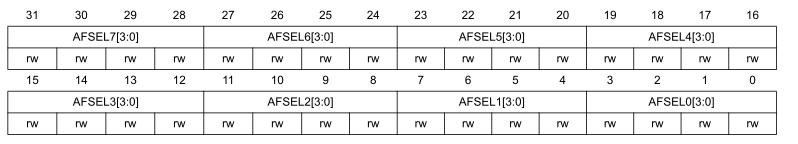

# Регистры настройки портов ввода/вывода общего назначения (GPIO)

## Регистр настройки режима работы порта (GPIOx_MODER)(x = A-F)

Смещение адреса: `0x00`
Значение после сброса для порта A: `0x2800 0000`
Значение после сброса для остальных портов: `0x0000 0000`

Биты 2*y+1:2y `MODERy[1:0]`: Конфигурация порта x битами y=0-15

* Биты устанавливается и сбрасывается программно.
  * `00`: Режим входа (значение по сбросу)
  * `01`: Режим выхода
  * `10`: Альтернативная функция
  * `11`: Аналоговый режим

## Регистр настройки режима работы порта в режиме выхода (GPIOx_OTYPER)(x = A-F)

Смещение адреса: `0x04`
Значение после сброса: `0x0000 0000`

Биты 31:16 Зарезервированы
Биты 15-0 `OTy`: Конфигурация порта x битами y=0-15

* Биты устанавливается и сбрасывается программно для настройки типа выходного каскада порта.
  * `0`: Режим push-pull (значение по сбросу)
  * `1`: Режим открытый сток

## Регистр настройки максимальной скорости переключения порта (GPIOx_OSPEEDR)(x = A-F)

Смещение адреса: `0x08`
Значение после сброса для порта A: `0x0С00 0000`
Значение после сброса для остальных портов: `0x0000 0000`

Биты 2*y+1:2y `OSPEEDRy[1:0]`: Конфигурация порта x битами y=0-15

* Биты устанавливается и сбрасывается программно.
  * `x0`: Низкая скорость (значение по сбросу)
  * `01`: Средняя скорость
  * `10`: Максимальная скорость

## Регистр настройки подтяжки порта (GPIOx_PUPDR)(x = A-F)

Смещение адреса: `0x0С`
Значение после сброса для порта A: `0x2400 0000`
Значение после сброса для остальных портов: `0x0000 0000`

Биты 2*y+1:2y `PUPDRy[1:0]`: Конфигурация порта x битами y=0-15

* Биты устанавливается и сбрасывается программно.
  * `00`: Отсутствие подтяжки
  * `01`: Подтяжка к положительной шине
  * `10`: Подтяжка к нулевой шине
  * `11`: Зарезервировано

## Регистр входных значений порта (GPIOx_IDR)(x = A-F)

Смещение адреса: `0x10`
Значение после сброса : `0x0000 XXXX` (X - неопределенное значение)

Биты 15-0 `IDRy`: Входное значение порта x в битах y=0-15

* Биты доступны только для чтения. Они содержат входное значение соответствующего порта ввода/вывода.

## Регистр выходных значения порта (GPIOx_ODR)(x = A-F)

 Смещение адреса: `0x14`
 Значение после сброса: `0x0000 0000`

Биты 15-0 `ODRy`: Выходное значение порта x в битах y=0-15

* Биты устанавливается и сбрасывается программно.

## Регистр установки/сбросы выходного значения порта (GPIOx_OTYPER)(x = A-F)

Смещение адреса: `0x18`
Значение после сброса: `0x0000 0000`

Биты 31-16 `BRy`: Сброс бита y=0-15 порта x

* Биты предназначены только для записи. Чтение битов вернет значение `0x0000`.
  * `0`: Нет результата
  * `1`: Сбрасывает соответствующий бит в регистре ODR
  * *Примечание:  Если установлены BSx, так и BRx, то в таком случае  BSx имеет приоритет*

## Младший регистр настройки альтернативной функции порта (GPIOx_AFRL)(x = A-F)

Смещение адреса: `0x20`
Значение после сброса: `0x0000 0000`

Биты 31-0 `AFSELy[3:0]`: Выбор альтернативной функции порта x ножек y=0-7

* Биты устанавливаются и сбрасывается программно.
  * `0000`: AF0
  * `0001`: AF1
  * `0010`: AF2
  * `0011`: AF3
  * `0100`: AF4
  * `0101`: AF5
  * `0110`: AF6
  * `0111`: AF7

## Старший регистр настройки альтернативной функции порта (GPIOx_AFRH)(x = A-F)

Смещение адреса: `0x24`
Значение после сброса: `0x0000 0000`

Биты 31-0 `AFSEHy[3:0]`: Выбор альтернативной функции порта x ножек y=8-15

* Биты устанавливаются и сбрасывается программно.
  * `0000`: AF0
  * `0001`: AF1
  * `0010`: AF2
  * `0011`: AF3
  * `0100`: AF4
  * `0101`: AF5
  * `0110`: AF6
  * `0111`: AF7

## Регистр сброса порта в режиме выхода (GPIOx_BRR)(x = A-F)

Смещение адреса: `0x28`
Значение после сброса: `0x0000 0000`
Биты 31:16 Зарезервированы

Биты 15-0 `BRy`: Конфигурация порта x битами y=0-15

* Биты предназначены только для записи. Чтение битов вернет значение `0x0000`.
  * `0`: Нет результата
  * `1`: Сбрасывает соответствующий бит в регистре ODR
