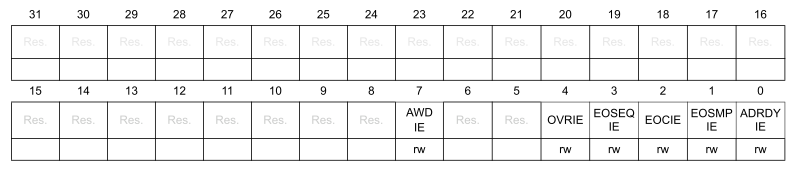
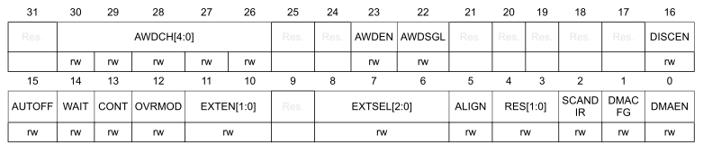
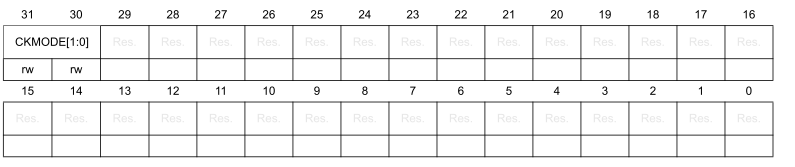
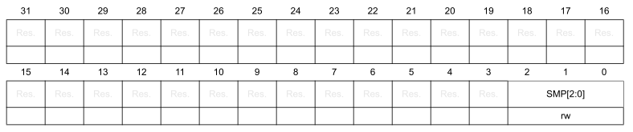
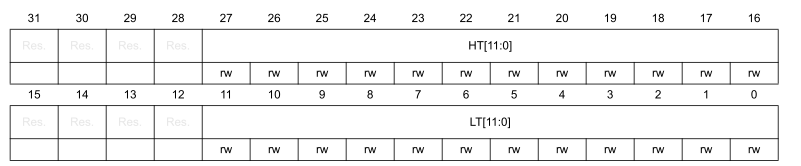
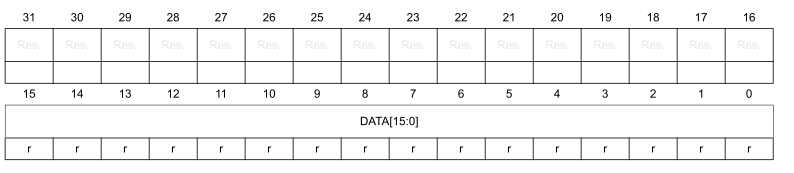

# Регистр АЦП - Analog-to-digital converter (ADC)

В этом разделе дается подробное описание регистров ADC.

- [Регистр АЦП - Analog-to-digital converter (ADC)](#регистр-ацп---analog-to-digital-converter-adc)
  - [Регистр прерывания и состояния](#регистр-прерывания-и-состояния)
  - [Регистр разрешения прерываний](#регистр-разрешения-прерываний)
  - [Регистр управления](#регистр-управления)
  - [Регистр настройки 1](#регистр-настройки-1)
  - [Регистр конфигурации 2](#регистр-конфигурации-2)
  - [Регистр времени выборки](#регистр-времени-выборки)
  - [Регистр уровней сравнения аналогового компаратора](#регистр-уровней-сравнения-аналогового-компаратора)
  - [Регистр выбора канала преобразования](#регистр-выбора-канала-преобразования)
  - [Регистр данных](#регистр-данных)

---

## Регистр прерывания и состояния

ADC interrupt and status register (ADCx->ISR)

Смещение адреса: `0x00`

Значение после сброса: `0x0000 0000`

Биты 31-8: Зарезервированы.

Бит 7 `AWD`: Флаг аналогового сторожевого таймера. Бит устанавливается аппаратным способом, когда преобразованное напряжение пересекает значения, загруженные в
регистры `ADCx->LTR` и `ADCx->HTR`. Бит очищается программно, записывая в него 1.

- `0`: Событие аналогового сторожевого таймера не произошло (или флаг события уже был проверен и сброшен программно)
- `1`: Произошло событие аналогового сторожевого таймера

Биты 6-5: Зарезервированы.

Бит 4 `OVR`: Флаг переполнения регистра АЦП. Бит устанавливается аппаратно при переполнении, когда новое преобразование завершено, в то время как флаг `EOC` уже был установлен. Бит очищается программно, записывая в него 1.

- `0`: Переполнения не произошло (или флаг события уже был проверен и сброшен программно)
- `1`: Произошло переполнение

Бит 3 `EOSEQ`: Флаг завершения преобразования последовательности каналов АЦП. Бит устанавливается аппаратно в конце преобразования выбранной битами `CHSEL` последовательности каналов. Бит очищается программно, записывая в него 1.

- `0`: Последовательность преобразования не завершена (или флаг события уже был проверен и сброшен программно)
- `1`: Последовательность преобразования завершена

Бит 2 `EOC`: Флаг окончания преобразования АЦП. Бит устанавливается аппаратно в конце каждого преобразования канала, когда в регистре `ADCx->DR` доступен новый результат данных. Бит очищается программно, записывая в него 1.

- `0`: Преобразование канала не завершено (или флаг события уже был проверен и сброшен программно)
- `1`: Преобразование канала завершено

Бит 1 `EOSMP`: Флаг окончания выборки АЦП. Бит устанавливается аппаратно во время преобразования, в конце фазы выборки. Флаг очищается программно, записывая в него 1.

- `0`: Выборка не завершена (или флаг события уже был проверен и сброшен программно)
- `1`: Выборка завершена

Бит 0 `ADRDY`: Флаг готовности АЦП. Бит устанавливается аппаратно после включения АЦП (бит `ADEN`=1) и когда АЦП достигает состояния, в котором он готов принимать новые запросы на преобразование. Бит очищается программно, записывая в него 1.

- `0`: АЦП еще не готов начать преобразование (или флаг события уже был проверен и сброшен программно)
- `1`: АЦП готов к началу преобразования

---

## Регистр разрешения прерываний

ADC interrupt enable register (`ADCx->IER`)

Смещение адреса: `0x04`

Значение после сброса: `0x0000 0000`

Биты 31-8: Зарезервированы.

Бит 7 `AWDIE`: Включение прерывания по аналоговому компаратору. Бит устанавливается и сбрасывается программно.

- `0`: Выключение прерывания по аналоговому компаратору
- `1`: Включение прерывания по аналоговому компаратору

> :bulb: **Примечание:** Программному обеспечению разрешается записывать этот бит только при `ADSTART`=0 (что гарантирует, что преобразование не выполняется).

Биты 6-5: Зарезервированы.

Бит 4 `OVRIE`: Включение прерывания по переполнению регистра АЦП. Бит устанавливается и сбрасывается программно.

- `0`: Выключение прерывания по переполнению регистра АЦП
- `1`: Включение прерывания по переполнению регистра АЦП

Бит 3 `EOSEQIE`: Включение прерывания по преобразования последовательности каналов АЦП. Бит устанавливается и сбрасывается программно.

- `0`: Выключение прерывания по окончанию преобразования последовательности каналов АЦП
- `1`: Включение прерывания по окончанию преобразования последовательности каналов АЦП

Бит 2 `EOCIE`: Включение прерывания по окончанию преобразования АЦП. Бит устанавливается и сбрасывается программно.

- `0`: Выключение прерывания по событию окончанию преобразования АЦП
- `1`: Включение прерывания по событию окончанию преобразования АЦП

Бит 1 `EOSMPIE`: Включение прерывания по окончания выборки АЦП. Бит устанавливается и сбрасывается программно.

- `0`: Выключение прерывания по окончанию выборки АЦП
- `1`: Включение прерывания по окончанию выборки АЦП

Бит 0 `ADRDYIE`: Включение прерывания по готовности АЦП. Бит устанавливается и сбрасывается программно.

- `0`: Выключение прерывания по готовности АЦП
- `1`: Включение прерывания по готовности АЦП

---

## Регистр управления

ADC control register (`ADCx->CR`)

Смещение адреса: `0x08`

Значение после сброса: `0x0000 0000`

Бит 31 `ADCAL`: Калибровка АЦП. Бит устанавливается программно для запуска калибровки АЦП и очищается аппаратно по окончании калибровки.

- `0`: Калибровка АЦП завершена
- `1`: Установка 1 запускает калибровку АЦП. Чтение 1 означает, что идет процесс калибровки

> :bulb: **Примечание:** Разрешается устанавливать `ADCAL` только в том случае, если АЦП отключен (`ADCAL`=0, `ADSTART`=0, `ADSTP`=0, `ADDIS`=0 и `ADEN`=0).

Биты 30-5: Зарезервированы.

Бит 4 `ADSTP`: Остановка преобразования АЦП. Бит устанавливается программно для остановки текущего преобразования. Очищается аппаратно, когда фактически преобразование остановлено и АЦП готов принять новую команду запуска преобразования.

- `0`: преобразование АЦП не останавливается
- `1`: Установка 1 останавливает преобразование АЦП. Чтение 1 означает, что идет процесс остановки

> :bulb: **Примечание:** Установка `ADSTP` в 1 эффективна только в том случае, если `ADSTART`=1 и `ADDIS` =0 (АЦП включен и может преобразовывать, и нет ожидающего запроса на отключение АЦП).

Бит 3: Зарезервирован.

Бит 2 `ADSTART`: Команда запуска преобразования АЦП. Бит устанавливается программно для запуска преобразования АЦП. В зависимости от битов конфигурации `EXTEN[1:0]`,
преобразование либо начинается немедленно (программный триггер), либо после возникновения события аппаратного триггера (аппаратный триггер).

Бит очищается аппаратно:

– В режиме одиночного преобразования (`CONT`=0, `DISCEN`=0), когда выбран программный триггер (`EXTEN`=00): при появление флага окончания последовательности преобразования (`EOSEQ`).
– В режиме прерывистого преобразования (`CONT`=0, `DISCEN`=1), когда выбран программный триггер
(`EXTEN`=00): при после появления флага окончания преобразования (`EOC`).
– Во всех остальных случаях: после выполнения команды `ADSTP`, одновременно с тем, как бит
`ADSTP` очищается аппаратно.

- `0`: АЦП не запускает преобразование
- `1`: Установка 1 запускает преобразование АЦП. Чтение 1 означает, что идет процесс преобразования

> :bulb: **Примечание:** Разрешено устанавливать ADSTART только при `ADEN`=1 и `ADDIS`=0 (АЦП включен и ожидающий запрос на отключение АЦП отсутствует).

Бит 1 `ADDIS`: Выключение АЦП. Бит устанавливается программно для отключения АЦП. Очищается аппаратно, когда фактически АЦП отключен.

- `0`: АЦП не выключается
- `1`: Установка 1 отключает АЦП. Чтение 1 означает, что идет процесс отключения

> :bulb: **Примечание:** Установка ADDIS в 1 работает только в том случае, если `ADEN`=1 и `ADSTART` =0 (что гарантирует, что преобразование не выполняется).

Бит 0 `ADDEN`: Включение АЦП. Бит устанавливается программно для включения АЦП. АЦП будет  готов к работе, как только будет установлен флаг `ADRDY`.

- `0`: АЦП выключен
- `1`: Установка 1 включает АЦП. Чтение 1 означает, что АЦП включен

> :bulb: **Примечание:**  Устанавливать ADEN можно только тогда, когда все биты регистров ADCx->CR равны 0 (`ADCAL`=0, `ADSTP`=0, `ADSTART`=0, `ADDIS`=0 и `ADEN`=0).

---

## Регистр настройки 1

ADC configuration register 1 (`ADCx->CFGR1`)

Смещение адреса: `0x0C`

Значение после сброса: `0x0000 0000`

Бит 31: Зарезервирован.

Биты 30-26 `AWDCH[4:0]`: Выбор канала для аналогового компаратора.

- `0000`: Аналоговый компаратор подключается к каналу 0 АЦП
- `0001`: Аналоговый компаратор подключается к каналу 1 АЦП
- . . . .
- `10010`: Аналоговый компаратор подключается к каналу 18 АЦП

> :bulb: **Примечание:** Выбранный канал, так же должен быть установлен в регистре `CHSELR`.
>
> :bulb: **Примечание:** Разрешается менять и устанавливать эти биты только тогда, когда `ADSTART`=0 (что гарантирует, что
преобразование не выполняется).

Биты 25-24: Зарезервированы.

Бит 23 `AWDEN`: Включение аналогового компаратора. Биты устанавливаются и сбрасываются программно.

- `0`: Аналоговый компаратор выключен
- `1`: Аналоговый компаратор включен

> :bulb: **Примечание:** Разрешается менять и устанавливать этот бит только тогда, когда `ADSTART`=0 (что гарантирует, что
преобразование не выполняется).

Бит 22 `AWDSGL`: Включение аналогового компаратора для одного канала или для всех каналов АЦП. Биты устанавливаются и сбрасываются программно.

- `0`: Аналоговый компаратор подключен для всех каналов
- `1`: Аналоговый компаратор подключен к одному каналу ( канал выбирается в регистре `AWDCH[4:0]` )

> :bulb: **Примечание:** Разрешается менять и устанавливать этот бит только тогда, когда `ADSTART`=0 (что гарантирует, что
преобразование не выполняется).

Биты 21-17: Зарезервированы.

Бит 16 `DISCEN`: Включение прерывистого режима работы АЦП. Биты устанавливаются и сбрасываются программно.

- `0`: Прерывистый режим АЦП выключен
- `1`: Прерывистый режим АЦП включен

> :bulb: **Примечание:** Разрешается менять и устанавливать этот бит только тогда, когда `ADSTART`=0 (что гарантирует, что
преобразование не выполняется).

> :bulb: **Примечание:** Невозможно включить как прерывистый режим, так и непрерывный режим:
запрещено устанавливать оба бита `DISCEN`=1 и `CONT`=1.

Бит 15 `AUTOFF`: Включение авто-выключения АЦП. Биты устанавливаются и сбрасываются программно.

- `0`: Авто-выключение выключено
- `1`: Авто-выключение включено

> :bulb: **Примечание:** Разрешается менять и устанавливать этот бит только тогда, когда `ADSTART`=0 (что гарантирует, что
преобразование не выполняется).

Бит 14 `WAIT`: Включение ожидания преобразования АЦП. Биты устанавливаются и сбрасываются программно.

- `0`: Выключение ожидания преобразования АЦП
- `1`: Включение ожидания преобразования АЦП

> :bulb: **Примечание:** Разрешается менять и устанавливать этот бит только тогда, когда `ADSTART`=0 (что гарантирует, что
преобразование не выполняется).

Бит 13 `CONT`: Включение однократного/без остановочного преобразования. Биты устанавливаются и сбрасываются программно.

- `0`: Однократный режим преобразования АЦП включен
- `1`: Без остановочный режим преобразования АЦП включен

> :bulb: **Примечание:** Разрешается менять и устанавливать этот бит только тогда, когда `ADSTART`=0 (что гарантирует, что
преобразование не выполняется).

> :bulb: **Примечание:** Невозможно включить как прерывистый режим, так и непрерывный режим:
запрещено устанавливать оба бита `DISCEN`=1 и `CONT`=1.

Бит 12 `OVRMOD`: Настройка режима переполнения АЦП. Биты устанавливаются и сбрасываются программно.

- `0`: При обнаружении переполнения регистр `ADC_DR` сохранят свои прежние данные
- `1`: При обнаружении переполнения регистр `ADC_DR` перезаписывает свои прежние данные на вновь измеренные

> :bulb: **Примечание:** Разрешается менять и устанавливать этот бит только тогда, когда `ADSTART`=0 (что гарантирует, что
преобразование не выполняется).

Бит 11-10 `EXTEN[1:0]`: Настройка источника запуска АЦП и выбора полярности запуска. Биты устанавливаются и сбрасываются программно.

- `00`: Аппаратный источник запуска АЦП отключен ( запуск преобразования осуществляется программным способом)
- `01`: Аппаратный источник запуска АЦП включен - по переднему фронту
- `10`: Аппаратный источник запуска АЦП включен - по заднему фронту (по спаду)
- `11`: Аппаратный источник запуска АЦП включен - по любому из событий ( и по спаду и по фронту)
перезаписывает свои прежние данные на вновь измеренные

> :bulb: **Примечание:** Разрешается менять и устанавливать этот бит только тогда, когда `ADSTART`=0 (что гарантирует, что
преобразование не выполняется).

Бит 9: Зарезервирован.

Бит 8-6 `EXTEN[1:0]`: Выбор источника (триггера) запуска АЦП. Биты устанавливаются и сбрасываются программно.

Описание источников событий находится в таблице

- `000`: событие TRG0
- `001`: событие TRG1
- `010`: событие TRG2
- `011`: событие TRG3
- `100`: событие TRG4
- `101`: событие TRG5
- `110`: событие TRG6
- `111`: событие TRG7

> :bulb: **Примечание:** Разрешается менять и устанавливать этот бит только тогда, когда `ADSTART`=0 (что гарантирует, что
преобразование не выполняется).

Бит 5 `ALIGN`: Выравнивание данных. Биты устанавливаются и сбрасываются программно.

- `0`: Выравнивание по правому краю
- `1`: Выравнивание по левому краю

> :bulb: **Примечание:** Разрешается менять и устанавливать этот бит только тогда, когда `ADSTART`=0 (что гарантирует, что
преобразование не выполняется).

Бит 4-3 `RES[1:0]`: Разрядность данных. Биты устанавливаются и сбрасываются программно.

- `00`: 12-бит
- `01`: 10-бит
- `10`: 8-бит
- `11`: 6-бит

> :bulb: **Примечание:** Разрешается менять и устанавливать этот бит только тогда, когда `ADEN`=0

Бит 2 `SCANDIR`: Выбор направления конверсии каналов. Биты устанавливаются и сбрасываются программно.

- `0`: Сканирование каналов снизу-вверх ( от `CHSEL0` до `CHSEL18`)
- `1`: Сканирование каналов сверху-вниз ( от `CHSEL18` до `CHSEL0`)

> :bulb: **Примечание:** Разрешается менять и устанавливать этот бит только тогда, когда `ADSTART`=0 (что гарантирует, что
преобразование не выполняется).

Бит 1 `DMACFG`: Настройка ПДП(`DMA`). Биты устанавливаются и сбрасываются программно.

- `0`: Однократная работа ПДП (`DMA`)
- `1`: Безостановочная работа ПДП (`DMA`)

> :bulb: **Примечание:** Разрешается менять и устанавливать этот бит только тогда, когда `ADSTART`=0 (что гарантирует, что
преобразование не выполняется).

Бит 0 `DMAEN`: Включение ПДП(`DMA`). Этот бит устанавливается и очищается программно для обеспечения генерации запросов DMA. Это позволяет
использовать контроллер DMA для автоматического управления преобразованными данными. Для получения более подробной информации обратитесь к документации (Datasheet) МК.

- `0`: ПДП (`DMA`) выключен
- `1`: ПДП (`DMA`) включен

> :bulb: **Примечание:** Разрешается менять и устанавливать этот бит только тогда, когда `ADSTART`=0 (что гарантирует, что
преобразование не выполняется).

---

## Регистр конфигурации 2

ADC configuration register 2 (`ADCx->CFGR2`)

Смещение адреса: `0x10`

Значение после сброса: `0x0000 0000`

Биты 31-30 `CKMODE[1:0]`: Настройка тактирования АЦП. Биты устанавливаются и сбрасываются программно.

- `00`: `ADCCLK` (асинхронный режим тактирования)
- `01`: `PCLK/2` (синхронный режим тактирования)
- `10`: `PCLK/4` (синхронный режим тактирования)
- `11`:  Зарезервировано

Во всех режимах синхронной работы задержка от срабатывания таймера до начала преобразования отсутствует.

> :bulb: **Примечание:** Программному обеспечению разрешается записывать эти биты только в том случае, если АЦП отключен (`ADCA`L=0, `ADSTART`=0,
`ADSTP`=0, `ADDIS`=0 и `ADEN`=0).

Биты 29-0: Зарезервированы.

## Регистр времени выборки

ADC sampling time register (`ADCx->SMPR`)

Смещение адреса: `0x14`

Значение после сброса: `0x0000 0000`

Биты 31-3: Зарезервированы.

Биты 2-0 `SMP[2:0]`: Настройка времени выборки АЦП. Биты устанавливаются и сбрасываются программно.

- `000`: 1,5 цикла работы АЦП
- `000`: 7,5 цикла работы АЦП
- `000`: 13,5 цикла работы АЦП
- `000`: 28,5 цикла работы АЦП
- `000`: 41,5 цикла работы АЦП
- `000`: 55,5 цикла работы АЦП
- `000`: 71,5 цикла работы АЦП
- `000`: 239,5 цикла работы АЦП

> :bulb: **Примечание:** Разрешается менять и устанавливать этот бит только тогда, когда `ADSTART`=0 (что гарантирует, что
преобразование не выполняется).

## Регистр уровней сравнения аналогового компаратора

ADC watchdog threshold register (`ADCx->TR`)

Смещение адреса: `0x20`

Значение после сброса: `0x0FFF 0000`

Биты 31-28: Зарезервированы.

Биты 27-16 `HT[11:0]`: Верхний порог срабатывания компаратора

> :bulb: **Примечание:** Разрешается менять и устанавливать этот бит только тогда, когда `ADSTART`=0 (что гарантирует, что
преобразование не выполняется).

Биты 15-12: Зарезервированы.

Биты 11-0 `HT[11:0]`: Нижний порог срабатывания компаратора

> :bulb: **Примечание:** Разрешается менять и устанавливать этот бит только тогда, когда `ADSTART`=0 (что гарантирует, что
преобразование не выполняется).

## Регистр выбора канала преобразования

ADC channel selection register (`ADCx->CHSELR`)

Смещение адреса: `0x28`

Значение после сброса: `0x0000 0000`

Биты 31-19: Зарезервированы.

Биты 18-0 `CHSELx`: Выбор канала `x`. Биты устанавливаются и сбрасываются программно.

- `0`: Канал не участвует в преобразовании
- `1`: Канал участвует в преобразовании

> :bulb: **Примечание:** Разрешается менять и устанавливать этот бит только тогда, когда `ADSTART`=0 (что гарантирует, что
преобразование не выполняется).

## Регистр данных

ADC data register (`ADCx->DR`)

Смещение адреса: `0x40`

Значение после сброса: `0x0000 0000`

Биты 31-16: Зарезервированы.

Биты 15-0 `DATA[15:0]`: Данные преобразования АЦП. Эти биты доступны только для чтения. Они содержат результат преобразования по последнему преобразованному каналу.   Данные выровнены по левому или правому краю. Сразу после завершения калибровки в `DATA[6:0]` находится калибровочный коэффициент.
