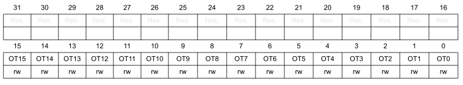
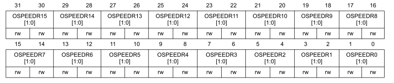
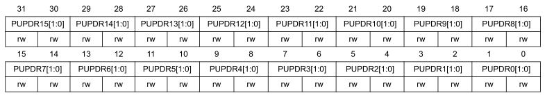
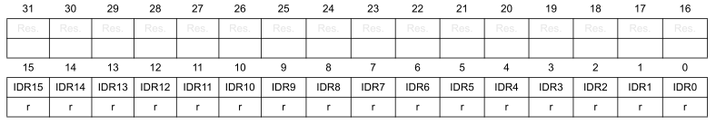
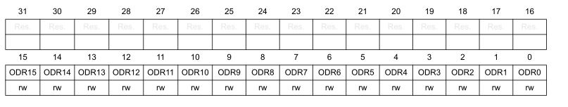
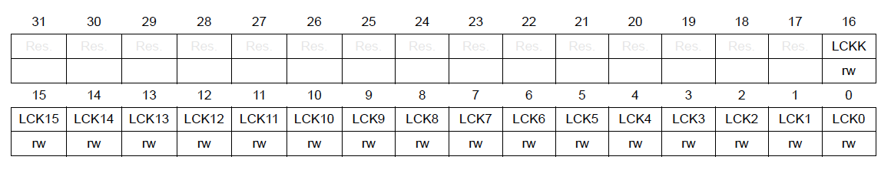
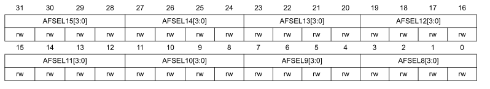
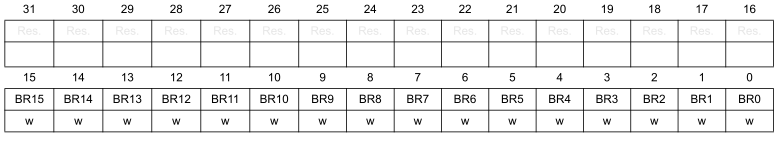

# Регистры портов ввода/вывода общего назначения - General-Purpose I/Os (GPIO)

В этом разделе дается подробное описание регистров GPIO.

Запись в регистры может осуществляться в режиме слова (4 байта), полуслова (2 байта) или байта.

- [Регистры портов ввода/вывода общего назначения - General-Purpose I/Os (GPIO)](#регистры-портов-вводавывода-общего-назначения---general-purpose-ios-gpio)
  - [Регистр режима работы](#регистр-режима-работы)
  - [Регистр выходного буфера в режиме вывода](#регистр-выходного-буфера-в-режиме-вывода)
  - [Регистр скорости нарастания фронта в режиме вывода](#регистр-скорости-нарастания-фронта-в-режиме-вывода)
  - [Регистр подтягивающих резисторов](#регистр-подтягивающих-резисторов)
  - [Регистр входных данных](#регистр-входных-данных)
  - [Регистр выходных данных](#регистр-выходных-данных)
  - [Регистр установки/сброса битов выходного данных](#регистр-установкисброса-битов-выходного-данных)
  - [Регистр блокировки настройки порта](#регистр-блокировки-настройки-порта)
  - [Младший регистр альтернативной функции](#младший-регистр-альтернативной-функции)
  - [Старший регистр альтернативной функции](#старший-регистр-альтернативной-функции)
  - [Регистр сброса битов выходного данных](#регистр-сброса-битов-выходного-данных)

---

## Регистр режима работы

GPIO port mode register (`GPIOx->MODER`, x = A-F)

Смещение адреса: `0x00`

Значение после сброса:

- для порта A: `0x2800 0000`
- для остальных портов: `0x0000 0000`

Пара бит `MODERy[1:0]` задает режим линии `y` (0-15) порта `x` (A-F). Биты устанавливаются и сбрасываются программно.

- `00`: Режим ввода (значение после сброса)
- `01`: Режим вывода
- `10`: Режим альтернативной функции
- `11`: Аналоговый режим

---

## Регистр выходного буфера в режиме вывода

GPIO port output type register (`GPIOx->OTYPER`, x = A-F)

Смещение адреса: `0x04`

Значение после сброса: `0x0000 0000`

Биты 31-16: Зарезервированы

Биты 15-0 `OTy`: Выбирают выходной буфер линии `y` (0-15) порта `x` (A-F). Биты устанавливаются и сбрасываются программно для настройки типа выходного буфера порта.

- `0`: Режим push-pull (значение после сброса)
- `1`: Режим открытый сток

---

## Регистр скорости нарастания фронта в режиме вывода

GPIO port output speed register (`GPIOx->OSPEEDR`, x = A..F)

Смещение адреса: `0x08`

Значение после сброса:

- для порта A: `0x0С00 0000`
- для остальных портов: `0x0000 0000`

Пара бит `OSPEEDRy[1:0]` задает скорость линии `y` (0-15) порта `x` (A-F). Биты устанавливаются и сбрасываются программно.

- `x0`: Низкая скорость (значение после сброса)
- `01`: Средняя скорость
- `10`: Максимальная скорость

> :bulb: **Примечание:** Смотрите техническое описание (Datasheet) МК для получения информации о частотных характеристиках, источнике питания и условия нагрузки для каждой скорости.

---

## Регистр подтягивающих резисторов

GPIO port pull-up/pull-down register (`GPIOx->PUPDR`, x = A-F)

Смещение адреса: `0x0С`

Значение после сброса:

- для порта A: `0x2400 0000`
- для остальных портов: `0x0000 0000`

Пара бит `PUPDRy[1:0]` задает режим подтягивающих резисторов линии `y` (0-15) порта `x` (A-F). Биты устанавливаются и сбрасываются программно.

- `00`: Нет подтягивающих резисторов
- `01`: Подтягивающий резистор к питанию (pull-up)
- `10`: Подтягивающий резистор к общей шине (pull-down)
- `11`: Зарезервировано

---

## Регистр входных данных

GPIO port input data register (`GPIOx->IDR`, x = A-F)

Смещение адреса: `0x10`

Значение после сброса : `0x0000 XXXX` (X - неопределенное значение)

Биты 15-0 `IDRy`: Состояние входа линии `y` (0-15) порта `x` (A-F). Биты доступны только для чтения.

---

## Регистр выходных данных

GPIO port output data register (`GPIOx->ODR`, x = A-F)

Смещение адреса: `0x14`

Значение после сброса: `0x0000 0000`

Биты 15-0 `ODRy`: Состояние выхода линии `y` (0-15) порта `x` (A-F). Биты устанавливаются и сбрасываются программно.

> :bulb: **Примечание:** Для индивидуальной установки и сброса битов регистра выходных данных порта можно использовать регистры `GPIOx_BSRR` или `GPIOx_BRR`.

---

## Регистр установки/сброса битов выходного данных

GPIO port bit set/reset register (`GPIOx->BSRR`, x = A..F)

Смещение адреса: `0x18`

Значение после сброса: `0x0000 0000`

Биты 31-16 `BRy`: Сброс бита линии `y` (0-15) порта `x` (A-F). Биты предназначены только для записи. Чтение битов вернет значение `0x0000`.

- `0`: Нет результата
- `1`: Сбрасывает соответствующий бит в регистре `ODR`

> :bulb: **Примечание:** Если установлены бит BSx и BRx одновременно, то BSx имеет приоритет.

Биты 31-16 `BSy`: Установка бита линии `y` (0-15) порта `x` (A-F). Биты предназначены только для записи. Чтение битов вернет значение `0x0000`.

- `0`: Нет результата
- `1`: Устанавливает соответствующий бит в регистре `ODR`

---

## Регистр блокировки настройки порта

GPIO port configuration lock register (`GPIOx->LCKR`, x = A..B)

Регистр используется для блокировки конфигурации линий порта. Значение битов [15:0] используется для выбора линии порта, конфигурация которого будет заблокирована. После определенной последовательности записи в бит 16 (`LCKK`) конфигурации линии порта будут заблокированы и не могут быть изменены до следующего сброса МК или порта.

Смещение адреса: `0x1C`

Значение после сброса: `0x0000 0000`

Биты 31-17: Зарезервированы.

Бит 16 `LCKK`: Ключ блокировки. Бит может быть прочитан в любое время, но его можно изменить только с помощью последовательности записи ключа блокировки.

- `0`: Ключ блокировки конфигурации порта не активен
- `1`: Ключ блокировки конфигурации порта активен. Регистр `GPIOx_LCKR` заблокирован до следующего сброса МК или периферийного модуля.

Последовательность блокировки:

1. Записать LCKK = 1 вместе с конфигурацией `LCK[15:0]`
2. Записать LCKK = 0 вместе с конфигурацией `LCK[15:0]`
3. Записать LCKK = 1 вместе с конфигурацией `LCK[15:0]`
4. Прочитать `GPIOx_LCKR`

Биты 15-0 `LCKy`: Блокировка конфигурации линии `y` (0-15) порта `x` (A-F). Биты предназначены для чтения и записи, но их значение после записи изменится только если `LCKK` = 0.

- `0`: Конфигурация линия разблокирована
- `1`: Конфигурация линии заблокирована

---

## Младший регистр альтернативной функции

GPIO alternate function low register (`GPIOx->AFRL`, x = A..F)

Смещение адреса: `0x20`

Значение после сброса: `0x0000 0000`

Биты 31-0 `AFSELy[3:0]`: Выбор альтернативной функции линии `y` (0-7) порта `x` (A-F). Биты устанавливаются и сбрасываются программно.

- `0000`: AF0
- `0001`: AF1
- `0010`: AF2
- `0011`: AF3
- `0100`: AF4
- `0101`: AF5
- `0110`: AF6
- `0111`: AF7
- Остальные коды зарезервированы

---

## Старший регистр альтернативной функции

GPIO alternate function high register (`GPIOx->AFRH`, x = A..F)

Смещение адреса: `0x24`

Значение после сброса: `0x0000 0000`

Биты 31-0 `AFSEHy[3:0]`: Выбор альтернативной функции линии `y` (8-15) порта `x` (A-F). Биты устанавливаются и сбрасываются программно.

- `0000`: AF0
- `0001`: AF1
- `0010`: AF2
- `0011`: AF3
- `0100`: AF4
- `0101`: AF5
- `0110`: AF6
- `0111`: AF7
- Остальные коды зарезервированы

---

## Регистр сброса битов выходного данных

GPIO port bit reset register (`GPIOx->BRR`, x =A..F)

Смещение адреса: `0x28`

Значение после сброса: `0x0000 0000`

Биты 31-16: Зарезервированы.

Биты 15-0 `BRy`: Сброс бита линии `y` (0-15) порта `x` (A-F). Биты предназначены только для записи. Чтение битов вернет значение `0x0000`.

- `0`: Нет результата
- `1`: Сбрасывает соответствующий бит в регистре `ODR`
