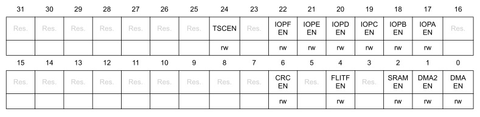
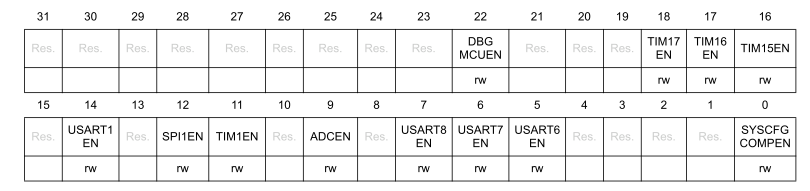

# Регистры сброса и управления тактированием - Reset and clock control (RCC)

В этом разделе дается подробное описание регистров RCC.

- [Регистры сброса и управления тактированием - Reset and clock control (RCC)](#регистры-сброса-и-управления-тактированием---reset-and-clock-control-rcc)
  - [Регистр включения тактирования периферийных модулей на шине AHB](#регистр-включения-тактирования-периферийных-модулей-на-шине-ahb)
  - [Регистр включения тактирования периферийных модулей на шине APB](#регистр-включения-тактирования-периферийных-модулей-на-шине-apb)

## Регистр включения тактирования периферийных модулей на шине AHB

AHB peripheral clock enable register (`RCC->AHBENR`)

Смещение адреса: `0x14`

Значение после сброса: `0x0000 0014`

> :bulb: **Примечание:**  Когда тактирование периферии выключено, значения периферийных регистров могут быть недоступны для чтения программой, и возвращаемое значение всегда равно 0x00.

Биты 31-25: Зарезервированы.

Бит 24 `TSCEN`: Включение тактирования контроллера сенсорной панели.
Устанавливается и сбрасывается программно.

-` 0`: `TCS` выключение тактирования
- `1`: `TCS` включение тактирования

Бит 22 `IOPFEN`: Включение тактирования порта ввода/вывода F.    Устанавливается и сбрасывается программно.

- `0`: выключение тактирования порта ввода/вывода F
- `1`: включение тактирования порта ввода/вывода F

Бит 21 `IOPEEN`: Включение тактирования порта ввода/вывода E.   Устанавливается и сбрасывается программно.

- `0`: выключение тактирования порта ввода/вывода E
- `1`: включение тактирования порта ввода/вывода E

Бит 20 `IOPDEN`: Включение тактирования порта ввода/вывода D. Устанавливается и сбрасывается программно.

- `0:` выключение тактирования порта ввода/вывода D
- `1`: включение тактирования порта ввода/вывода D

Бит 19 `IOPCEN`: Включение тактирования порта ввода/вывода C.   Устанавливается и сбрасывается программно.

- `0`: выключение тактирования порта ввода/вывода C
- `1`: включение тактирования порта ввода/вывода C  

Бит 18 `IOPBEN`: Включение тактирования порта ввода/вывода B.  Устанавливается и сбрасывается программно.

- `0`: выключение тактирования порта ввода/вывода B
- `1`: включение тактирования порта ввода/вывода B  

Бит 17 `IOPAEN`: Включение тактирования порта ввода/вывода A.   Устанавливается и сбрасывается программно.

- `0`: выключение тактирования порта ввода/вывода A
- `1`: включение тактирования порта ввода/вывода A

Биты 16-7: Зарезервированы.

Бит 6 `CRC`: Включение тактирования модуля `CRC`.  
 Устанавливается и сбрасывается программно.

- `0`: выключение тактирования модуля `CRC`
- `1`: включение тактирования модуля `CRC`

Бит 5: Зарезервирован.

Бит 4 `FLITFEN`: Включение тактирования интерфейса программирования Flash памяти `FLITF`.  
Устанавливается и сбрасывается программно.

- `0`: выключение тактирования интерфейса `FLITF` во время спящего режима
- `1`: включение тактирования интерфейса `FLITF` во время спящего режима

Бит 3: Зарезервирован.

Бит 2 `SRAMEN`: Включение тактирования интерфейса памяти `SRAM`.   Устанавливается и сбрасывается программно.

- `0`: выключение тактирования интерфейса `SRAM` во время спящего режима
- `1`: включение тактирования интерфейса `SRAM` во время спящего режима

Бит 1 `DMA2EN`: Включение тактирования модуля `DMA2`.       Устанавливается и сбрасывается программно.

- `0`: выключение тактирования модуля `DMA2`
- `1`: включение тактирования модуля `DMA2`

Бит 0 `DMAEN`: Включение тактирования модуля `DMA`.        Устанавливается и сбрасывается программно.

- `0`: выключение тактирования модуля `DMA`
- `1`: включение тактирования модуля `DMA`

## Регистр включения тактирования периферийных модулей на шине APB

APB2 peripheral clock enable register (`RCC->APB2ENR`)

Смещение адреса: `0x18`

Значение после сброса: `0x0000 0014`

> :bulb: **Примечание:**  Когда тактирование периферии выключено, значения периферийных регистров могут быть недоступны для чтения программой, и возвращаемое значение всегда равно 0x00.

Бит 21-29: Зарезервирован.

Бит 22 `DBGMCUEN`: Включение тактирования блока отладчика МК  
Устанавливается и сбрасывается программно.

- `0`: Выключение тактирования блока отладчика МК
- `1`: Включение тактирования блока отладчика МК

Бит 18 `TIM17EN`: Включение тактирования таймера `TIM17`  
Устанавливается и сбрасывается программно.

- `0`: Выключение тактирования таймера `TIM17`
- `1`: Включение тактирования таймера `TIM17`

Бит 17 `TIM16EN`: Включение тактирования таймера `TIM16`  
Устанавливается и сбрасывается программно.

- `0`: Выключение тактирования таймера `TIM16`  
- `1`: Включение тактирования таймера `TIM16`

Бит 16 `TIM15EN`: Включение тактирования таймера `TIM15`  
Устанавливается и сбрасывается программно.

Бит 15: Зарезервирован.

- `0`: Выключение тактирования таймера `TIM15`
- `1`: Включение тактирования таймера `TIM15`

Бит 13: Зарезервирован.  

Бит 14 `USART1EN`: Включение тактирования `USART1`  
Устанавливается и сбрасывается программно.

- `0`: Выключение тактирования `USART1`
- `1`: Включение тактирования `USART1`

Бит 12 `SPI1EN`: Включение тактирования `SPI1`  
Устанавливается и сбрасывается программно.

- `0`: Выключение тактирования `SPI1`
- `1`: Включение тактирования `SPI1`

Бит 10: Зарезервирован.

Бит 11 `TIM1EN`: Включение тактирования таймера `TIM11`  
Устанавливается и сбрасывается программно.

- `0`: Выключение тактирования таймера `TIM1`
- `1`: Включение тактирования таймера `TIM1`

Бит 9 `ADCEN`: Включение тактирования `ADC`  
Устанавливается и сбрасывается программно.

- `0`: Выключение тактирования АЦП 
- `1`: Включение тактирования АЦП

Бит 7 `USART8EN`: Включение тактирования `USART8`  
Устанавливается и сбрасывается программно.

- `0`: Выключение тактирования `USART8`
- `1`: Включение тактирования `USART8`

Бит 6 `USART7EN`: Включение тактирования `USART7`  
Устанавливается и сбрасывается программно.

- `0`: Выключение тактирования `USART7`
- `1`: Включение тактирования `USART7`

Бит 5 `USART6EN`: Включение тактирования `USART6`  
Устанавливается и сбрасывается программно.

- `0`: Выключение тактирования `USART6`
- `1`: Включение тактирования `USART6`

Биты 4-1: Зарезервирован.

Бит 0 `SYSCFGCOMPEN`: Включение тактирования `SYSCFG и COMP`  
Устанавливается и сбрасывается программно.

- `0`: Выключение тактирования `SYSCFG и COMP`
- `1`: Включение тактирования `SYSCFG и COMP`