# Регистр таймера с расширенными возможностями TIM1

В этом разделе дается подробное описание регистров TIM.

- [Регистр таймера с расширенными возможностями TIM1](#регистр-таймера-с-расширенными-возможностями-tim1)
  - [Первый регистр настройки CR1](#первый-регистр-настройки-cr1)
  - [аппаратных средств.](#аппаратных-средств)
  - [Второй регистр настройки CR2](#второй-регистр-настройки-cr2)
  - [Регистр управления подчиненным режимом TIM1](#регистр-управления-подчиненным-режимом-tim1)
  - [TIM1 DMA/регистр включения прерывания](#tim1-dmaрегистр-включения-прерывания)
  - [Регистр состояния TIM1](#регистр-состояния-tim1)
  - [Регистр генерации событий TIM1](#регистр-генерации-событий-tim1)
  - [TIM1 режим захвата/сравнения регистр 1 CCMR1](#tim1-режим-захватасравнения-регистр-1-ccmr1)
      - [**Режим сравнения выходных данных**](#режим-сравнения-выходных-данных)
    - [**Режим захвата входного сигнала**](#режим-захвата-входного-сигнала)
  - [TIM1 режим захвата/сравнения регистр 2 CCMR2](#tim1-режим-захватасравнения-регистр-2-ccmr2)
  - [мог иметь разное значение для входного каскада и для выходного каскада.](#мог-иметь-разное-значение-для-входного-каскада-и-для-выходного-каскада)
    - [**Режим сравнения выходных данных**](#режим-сравнения-выходных-данных-1)
    - [**Режим захвата входного сигнала**](#режим-захвата-входного-сигнала-1)
  - [Регистр включения захвата/сравнения TIM1](#регистр-включения-захватасравнения-tim1)
    - [**Канал CC1, настроенный в качестве входного:**](#канал-cc1-настроенный-в-качестве-входного)
  - [Счетчик TIM1](#счетчик-tim1)
  - [Счетчик TIM1](#счетчик-tim1-1)
  - [Предделитель TIM1](#предделитель-tim1)
  - [Регистр автоматической перезагрузки TIM1](#регистр-автоматической-перезагрузки-tim1)
  - [Регистр счетчика повторений TIM1](#регистр-счетчика-повторений-tim1)
  - [TIM1 регистр захвата/сравнения 1](#tim1-регистр-захватасравнения-1)
  - [TIM1 регистр захвата/сравнения 2](#tim1-регистр-захватасравнения-2)
  - [TIM1 регистр захвата/сравнения 3](#tim1-регистр-захватасравнения-3)
  - [TIM1 регистр захвата/сравнения 4](#tim1-регистр-захватасравнения-4)
  - [TIM1 авария и регистр мертвого времени](#tim1-авария-и-регистр-мертвого-времени)
  - [TIM1 настройки DMA](#tim1-настройки-dma)
  - [TIM1 настройки DMA](#tim1-настройки-dma-1)

---

## Первый регистр настройки CR1

TIM1 control register 1  (TIM1->CR1)

Смещение адреса: `0x00`

Значение после сброса: `0x0000`

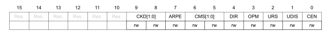

Биты 15-10: Зарезервированы.

Биты 9-8: `CKD[1:0]`: Битовое поле настраивает коэффициент деления между тактовой частотой таймера (`CK_INT`)  
 и тактовой частотой "мертвого времени" (`TDTS`),и частотой работы цифровых фильтров (`ETR`, `TIx`)

- `00`: T_dts=T_ck_int
- `01`: T_dts=2*T_ck_int
- `00`: T_dts=4*T_ck_int
- `00`: Зарезервировано 

Бит 7 `ARPE`: Включение автоматической предзагрузки.

- `0`: `TIMx_ARR` загрузка без буферизации
- `1`: `TIMx_ARR` загрузка с буферизацией

Биты 6-5: `CMS[1:0]`: Выбор режима выравнивая счетчика

- `00`: Режим выравнивания по краям. Счетчик ведет отсчет вверх или вниз в зависимости от бита направления 
(`DIR`). 
- `01`: Первый режим выравнивая по центру. Счетчик поочередно ведет отсчет вверх и вниз. 
Флаги прерывания выходных каналов сравнения, настроенных в режим выхода (`CCXS=00` в регистре `TIMx_CCMRx`), устанавливаются только при обратном отсчете счетчика. 
- `10`: Второй режим выравнивая по центру. Счетчик поочередно ведет отсчет вверх и вниз. 
Флаги прерывания выходных каналов сравнения, настроенных в режим выхода (`CCXS=00` в регистре `TIMx_CCMRx`), устанавливаются
только при подсчете счетчика. 
 - `11`: Третий режим выравнивая по центру. Счетчик поочередно ведет отсчет вверх и вниз. 
Флаги прерывания выходных каналов сравнения, настроенных в режим выхода (`CCXS=00` в регистре `TIMx_CCMRx`), устанавливаются
как при увеличении, так и при уменьшении счетчика.

> :bulb: **Примечание:** Не разрешается переключаться из режима выравнивания по краям в режим выравнивания по центру, пока
включен таймер (`CEN=1`).

Бит 4 `DIR`: Выбор направления счета счетчика

- `0`: Счетчик считает вверх
- `1`: Счетчик считает вниз

> :bulb: **Примечание:** Этот бит доступен только для чтения, только когда когда таймер настроен в режиме выравнивания по центру или в режиме энкодера.

Бит 3 `ONE`: Настройка одиночного режима 

- `0`: Счетчик не остановиться при событии обновления
- `1`: Счетчик остановиться при событии обновления

Бит 2 `URS`: Источник запроса на обновление  
Этот бит устанавливается и очищается программно для выбора источников событий `UEV`.
- `0`: Любое из следующих событий генерирует прерывание обновления или запрос `DMA`.     
События:   
  - Счетчик переполнен/пуст  
  - Установка бита `UG`  
  - Генерация обновлений через контроллер подчиненного режима  
- `1`: Только счетчик переполнен/пуст генерирует прерывание обновления или запрос `DMA`, если
включено.  

Бит 1 `UDIS`: Отключение обновления  
Этот бит устанавливается и очищается программно для включения/отключения генерации событий `UEV`.  
- `0`: `UEV` включен. Событие обновления (`UEV`) генерируется одним из следующих событий:
  - Счетчик переполнен/пуст
  - Установка бита `UG`
  - Генерация обновлений через контроллер подчиненного режима
Затем буферизованные регистры загружаются со значениями предварительной загрузки.
- `1`: `UEV` отключен. Событие обновления не генерируется, теневые регистры сохраняют свое значение 
(`ARR`, `PSC`, `CCRx`). Однако счетчик и предделитель повторно инициализируются, если установлен бит `UG` или если получен аппаратный сброс от контроллера подчиненного режима.

Бит 0 `CEN`: Включение таймера

- `0`: Включение таймера
- `1`: Выключение таймера
  
> :bulb: **Примечание:** Внешнее тактирование, режим энкодера могут работать только в том случае, если бит `CEN` был
предварительно установлен программным обеспечением. Однако режим запуска может автоматически устанавливать бит `CEN` с помощью
аппаратных средств.
---
## Второй регистр настройки CR2

TIM1 control register 2  (TIM1->CR2)

Смещение адреса: `0x04`

Значение после сброса: `0x0000`

Бит 15: Зарезервирован.

Бит 14 `OIS4`: Выходное состояние канала 1 (`OC4`)

- `0`: `OC4=0` (после "мертвого времени", если `OC4N` включен  когда) `MOE=0`
- `1`: `OC4=1` (после "мертвого времени", если `OC4N` включен  когда) `MOE=0`

Бит 13 `OIS3N`: Выходное состояние канала 1 (`OC3N`)

- `0`: `OC3N=0` после "мертвого времени" когда `MOE=0`
- `1`: `OC3N=1` после "мертвого времени" когда `MOE=0`

> :bulb: **Примечание:** Этот бит не может быть изменен до тех пор, пока не будет запрограммирован уровень блокировки 1, 2 или 3 
(Биты блокировки в регистре `TIMx_BDTR`).

Бит 12 `OIS3`: Выходное состояние канала 1 (`OC3`)

- `0`: `OC3=0` (после "мертвого времени", если `OC3N` включен  когда) `MOE=0`
- `1`: `OC3=1` (после "мертвого времени", если `OC3N` включен  когда) `MOE=0`

Бит 11 `OIS2N`: Выходное состояние канала 1 (`OC2N`)

- `0`: `OC2N=0` после "мертвого времени" когда `MOE=0`
- `1`: `OC2N=1` после "мертвого времени" когда `MOE=0`

> :bulb: **Примечание:** Этот бит не может быть изменен до тех пор, пока не будет запрограммирован уровень блокировки 1, 2 или 3 
(Биты блокировки в регистре `TIMx_BDTR`).

Бит 10 `OIS2`: Выходное состояние канала 1 (`OC2`)

- `0`: `OC2=0` (после "мертвого времени", если `OC2N` включен  когда) `MOE=0`
- `1`: `OC2=1` (после "мертвого времени", если `OC2N` включен  когда) `MOE=0`

Бит 9 `OIS1N`: Выходное состояние канала 1 (`OC1N`)

- `0`: `OC1N=0` после "мертвого времени" когда `MOE=0`
- `1`: `OC1N=1` после "мертвого времени" когда `MOE=0`

> :bulb: **Примечание:** Этот бит не может быть изменен до тех пор, пока не будет запрограммирован уровень блокировки 1, 2 или 3 
(Биты блокировки в регистре `TIMx_BDTR`).

Бит 8 `OIS1`: Выходное состояние канала 1 (`OC1`)

- `0`: `OC1=0` (после "мертвого времени", если `OC1N` включен  когда) `MOE=0`
- `1`: `OC1=1` (после "мертвого времени", если `OC1N` включен  когда) `MOE=0`

Бит 7 `TI1S`: Выбор T1

- `0`: Вывод `TIMx_CH1` подключен ко входу T1
- `1`: Вывод `TIMx_CH1`,`CH2`,`CH3`, подключены к T1 XOR

Бит 6-5 `MMS[1:0]`: настройка режима MASTER 
Эти биты позволяют выбирать информацию, которая будет отправлена в главном режиме на подчиненные таймеры для
синхронизации (TRGO).  
Комбинация выглядит следующим образом:  
- `000`: Сброс - бит `UG` из регистра `TIMx_EGR` используется в качестве выходного сигнала триггера (`TRGO`). Если
сброс генерируется входом триггера (контроллер подчиненного режима, настроенный в режиме сброса), то
сигнал на `TRGO` задерживается по сравнению с фактическим сбросом. 
- `001`: Включить - сигнал включения счетчика `CNT_EN` используется в качестве выходного сигнала триггера (`TRGO`). 
Полезно запускать несколько таймеров одновременно или управлять окном, в котором
включен подчиненный таймер. Сигнал включения счетчика генерируется логическим ИЛИ между управляющим битом `CEN` и
входом триггера при настройке в закрытом режиме. Когда сигнал включения счетчика
управляется входом триггера, на TRGO возникает задержка, за исключением случаев, когда выбран режим `master/slave`
(см. Описание бита `MSM `в регистре `TIMx_SMCR`). 
- `010`: Обновление - Событие обновления выбрано в качестве инициирующего подразделения
- `011`: Импульс сравнения - Выход триггера посылает положительный импульс, когда должен быть
установлен флаг `CC1IF` (даже если он уже был высоким), как только произошел захват или сопоставление. 
(TRGO). 
- `100`: Сравните - сигнал `OC1REF` используется в качестве выходного сигнала триггера (`TRGO`) 
- `101`: Сравните - сигнал `OC2REF` используется в качестве выходного сигнала триггера (`TRGO`) 
- `110`: Сравните - сигнал `OC3REF` используется в качестве выходного сигнала триггера (`TRGO`) 
- `111`: Сигнал сравнения - `OC4REF` используется в качестве выходного сигнала триггера (`TRGO`)

Бит 3: `CCDS`:Захват / сравнение выбора `DMA`
- `0`: запрос `CCx DMA` отправляется при возникновении события `CCx` 
- `1`: Запросы `CCX DMA`, отправляемые при возникновении события обновления

Бит 2 `CCU`: Захват / сравнение выбора обновления элемента управления
- `0`: Когда предварительно загружены управляющие биты захвата /сравнения (`CCPC=1`), они обновляются путем установки
только бита `COMG` 
- `1`: Когда предварительно загружены управляющие биты захвата/сравнения (`CCPC=`1), они обновляются путем установки
бита `COMG` или при возникновении восходящего фронта на `TRGI`
> :bulb: **Примечание:** Этот бит действует только на каналы, которые имеют дополнительный выход.

Бит 1: Зарезервирован.

Бит 0 `CCPC`: Захват / сравнение предварительно загруженного элемента управления
- `0`: Биты `CCxE`, `CCxNE` и `OCxM` предварительно не загружены 
- `1`: Биты `CCxE`, `CCxNE` и `OCxM` предварительно загружены, после записи они обновляются
только при возникновении события связи (`COM`) (бит `COMG` установлен или обнаружен восходящий фронт на
`TRGI`, в зависимости от бита `CCUS`).
> :bulb: **Примечание:** Этот бит действует только на каналы, которые имеют дополнительный выход.

---
## Регистр управления подчиненным режимом TIM1

TIM1 slave mode control register (TIM1->SMCR)

Смещение адреса: `0x08`

Значение после сброса: `0x0000`

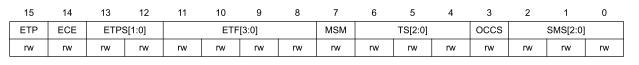

Бит 15 `ETP`: Настройка полярности внешнего триггера  
Этот бит определяет, используется ли `ETR` или `/ETR` для операций запуска
- `0`: `ETR` не инвертирован, активен на высоком уровне или на восходящем фронте. 
- `1`: `ETR` инвертирован, активен при низком уровне или спадающий фронт.

Бит `14` `ECE`: Включение внешнего тактирования
Этот бит включает режим внешней синхронизации 2.
- `0`: Режим внешнего тактирования  2 отключен
- `1`: Включен режим внешнего тактирования  2. Счетчик синхронизируется с любым активным фронтом
сигнала `ETRF`.
> :bulb: **Примечание:**  
> - 1: Установка бита ECE имеет тот же эффект, что и выбор режима внешней синхронизации 1 с
TRGI подключен к ETRF (SMS=111 и TS=111).
> - 2: Можно одновременно использовать режим внешних часов 2 со следующими подчиненными
режимами: режим сброса, закрытый режим и режим запуска. Тем не менее, TRGI не должен быть
подключен к ETRF в этом случае (биты TS не должны быть 111).
>- 3: Если режим внешних часов 1 и режим внешних часов 2 включены одновременно,
вход внешних часов - ETRF.

Биты 13-12 `ETPS[1:0]`: Устройство предварительной настройки внешнего триггера.  
Частота внешнего триггерного сигнала `ETRP` должна составлять не более 1/4 частоты `TIMxCLK`. Для
уменьшения частоты ETRP можно включить предварительный делитель. Это полезно при использовании высокой частоты тактирования.
- `00`: Предделитель выключен.
- `01`: Частота `ETRP`, деленная на 2
- `10`: Частота `ETRP`, деленная на 4
- `11`: Частота `ETRP`, деленная на 8

Биты 11-8 `ETF[3:0]`: Внешний триггерный фильтр
Это битовое определяет частоту, используемую для выборки сигнала, и длину
цифрового фильтра, применяемого к `ERP`. Цифровой фильтр состоит из счетчика событий, в котором
для проверки перехода на выходе требуется N последовательных событий:
- `0000`: Фильтра нет, отбор проб производится в fDTS 
- `0001`: f ВЫБОРКА = f CK_INT, N = 2 
- `0010`: выборка = fCK_INT, N = 4 
- `0011`: выборка = f CK_INT, N = 8 
- `0100`: Выборка FS = FDTS / 2, N = 6  
- `0101`: Выборка FS = FDTS / 2, N = 8 
- `0110`: Выборка FS = FDTS / 4, N = 6 
- `0111`: Выборка FS = FDTS / 4, N = 8  
- `1000`: fSAMPLING = FDTS / 8, N = 6 
- `1001`: fSAMPLING = FDTS / 8, N = 8 
- `1010`: Выборка FS = FDTS / 16, N = 5 
- `1011`: Выборка FS = FDTS / 16, N = 6 
- `1100`: Выборка FS = FDTS / 16, N = 8 
- `1101`: Выборка FS = FDTS / 32, N = 5 
- `1110`: fSAMPLING = FDTS / 32, N = 6 
- `1111`: fSAMPLING = FDTS / 32, N = 8
> :bulb: **Примечание:** Необходимо позаботиться о том, чтобы в первую очередь
`DTS`
заменяется в формуле на `CK_INT`, когда `ETF[3:0]` = 1, 
2 или 3.

Бит 7 `MSM`: режим Master/slave
- `0`: Никаких действий 
- `1`: Воздействие события на вход триггера (TRGI) задерживается, чтобы обеспечить идеальную
синхронизацию между текущим таймером и его подчиненными устройствами (через TRGO). Это полезно, если мы
хотим синхронизировать несколько раз по одному внешнему событию.

Биты 6-4 `TS[2:0]`: Выбор триггера
Это битовое поле выбирает вход триггера, который будет использоваться для синхронизации счетчика.
- `000`: Внутренний триггер 0 (ITR 0)  
- `001`: Внутренний триггер 1 (ITR1) 
- `010`: Внутренний триггер 2 (ITR 2) 
- `011`: Внутренний триггер 3 (ITR 3) 
- `100`: Детектор края TI1 (TI1F_ED) 
- `101`: Фильтрованный вход таймера 1 (TI1FP1) 
- `110`: Фильтрованный вход таймера 2 (TI2FP2) 
- `111`: Внешний триггерный вход (ETR)
> :bulb: **Примечание:** См. Таблицу 62: Подключение внутреннего триггера TIMX на стр. 372 для получения более подробной информации о значении
Itrh для каждого таймера.
Примечание: Эти биты должны быть изменены только тогда, когда они не используются (например, когда SMS = 000) на 
избегайте неправильного обнаружения краев при переходе.

Бит 3 `OCCS`: `OCREF` очистить выделение.
Этот бит используется для выбора источника `OCREF` очистки истоника.
- `0`:`OCREF_CLEAR_INT` подключен к входу` OCREF_CLEAR`
- `1`: `OCREF_CLEAR_IT` подключен к `ETRF`

Биты 2:0 `SMS`: Выбор подчиненного режима
При выборе внешних сигналов активный фронт триггерного сигнала (`TRGI`) привязывается к
полярности, выбранной на внешнем входе (см. Описание регистра управления входом и Регистра управления
).
- `000`: Режим ведомого устройства отключен - если CEN = ‘1’, то предварительный счетчик синхронизируется непосредственно внутренними
часами. 
- `001`: Режим кодирования 1 - Счетчик отсчитывает вверх / вниз по краю TI2FP1 в зависимости от уровня TI1FP2 . 
- `010`: Режим кодирования 2 - Счетчик отсчитывает вверх / вниз по краю TI1FP2 в зависимости от уровня TI2FP1. 
- `011`: Режим кодирования 3 - Счетчик отсчитывает вверх / вниз на обоих краях TI1FP1 и TI2FP2 
в зависимости от уровня другого входного сигнала. 
- `100`: Режим сброса - Восходящий фронт выбранного триггерного входа (TRGI) повторно инициализирует счетчик
и генерирует обновление регистров. 
- `101`: Закрытый режим - Счетчик таймера включается, когда вход триггера (TRGI) в высоком состоянии. 
Счетчик останавливается (но не сбрасывается), как только триггер становится в низком уровне. Управляются как запуск, так и остановка счетчика. 
- `110`: Режим запуска - Счетчик запускается с восходящего края триггера TRGI (но он не
сбрасывается). Контролируется только запуск счетчика. 
- `111`: Режим внешней синхронизации 1 - Возрастающие края выбранного триггера (TRGI) синхронизируют счетчик.
> :bulb: **Примечание:** Закрытый режим не должен использоваться, если TI1F_ED выбран в качестве входного сигнала триггера 
(TS=’100’). Действительно, TI1F_ED выдает 1 импульс для каждого перехода на TI1F, в то
время как режим стробирования проверяет уровень сигнала запуска.
Примечание: Часы ведомого таймера должны быть включены до получения событий от главного
таймера и не должны изменяться "на лету" во время получения триггеров от главного
таймера.

---

## TIM1 DMA/регистр включения прерывания 

TIM1 DMA/interrupt enable register (TIM1->DIER)

Смещение адреса: `0x0C`

Значение после сброса: `0x0000`

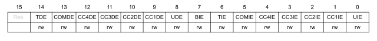

Бит 15: Зарезервирован.

Бит 14 `TDE`: Включение запроса триггера `DMA`
- `0`: Запрос триггера `DMA` отключен 
- `1`: Включен запрос триггера `DMA`

Бит 13 `COMDE`: Запрос `COM DMA` включить
- `0`: Запрос `COM DMA` отключен 
- `1`: Включен запрос `COM DMA`

Бит 12 `CC4DE`: Включение запроса на захват/сравнение 4 `DMA`
- `0`: Запрос `CC4 DMA` отключен 
- `1`: Включен запрос `CC4 DMA`

Бит 11 `CC3DE`: Включение запроса на захват/сравнение 3 `DMA`
- `0`: Запрос `CC3 DMA` отключен 
- `1`: Включен запрос `CC3 DMA`

Бит 10 `CC2DE`: Включение запроса на захват/сравнение 2 `DMA`
- `0`: Запрос `CC2 DMA` отключен 
- `1`: Включен запрос `CC2 DMA`

Бит 9 `CC1DE`: Включение запроса на захват/сравнение 1 `DMA`
- `0`: Запрос `CC1 DMA` отключен 
- `1`: Включен запрос `CC1 DMA`

Бит 8 `UDE`: Включение бновление запроса `DMA`
 - `0`: Запрос на обновление `DMA` отключен 
 - `1`: Запрос на обновление `DMA` включен

Бит 7 `BI`: Разрешить прерывание прерывания
- `0`: Прерывание прерывания отключено 
- `1`: Включено прерывание прерывания

Бит 6 `TIE`: включение триггерного прерывания  
- `0`: Прерывание триггера отключено 
- `1`: Включено прерывание триггера

Бит 5 `COMIE`: включение прерывания `COM`
- `0`: `COM`-прерывание отключено 
- `1`: Включено `COM`-прерывание

Бит 4 `CC4IE`: Включение прерывания захвата/сравнения 4
- `0`: Прерывание `CC4` отключено 
- `1`: Включено прерывание `CC4`

Бит 3 `CCIE`: Включение прерывания захвата/сравнения 3
- `0`: Прерывание `CC3` отключено 
- `1`: Включено прерывание `CC3`

Бит 2 `CC2IE`: Включение прерывания захвата/сравнения 2
- `0`: Прерывание `CC2` отключено 
- `1`: Включено прерывание `CC2`

Бит 1 `CCIE`: Захват/Сравнение 1 включение прерывания
- `0`: Прерывание `CC1` отключено 
- `1`: Включено прерывание `CC1`

Бит 0 `UIE`: Включение прерывания обновления
- `0`: Прерывание обновления отключено 
- `1`: Включено прерывание обновления

---
## Регистр состояния TIM1

TIM1 status register  (TIM1->SR)

Смещение адреса: `0x10`

Значение после сброса: `0x0000`

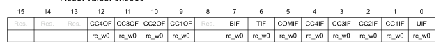

Бит 15-13: Зарезервированы.

Бит 12 `CC4OF`: флаг захвата/сравнения 4
- см. Описание CC1OF

Бит 11 `CC4OF`: флаг захвата/сравнения 4
- см. Описание CC1OF

Бит 10 `CC4OF`: флаг захвата/сравнения 4
- см. Описание CC1OF

Бит 9 `CC1OF`: Захват/Сравнение 1 флага перехвата захвата
Этот флаг устанавливается аппаратным обеспечением только в том случае, если соответствующий канал настроен в
режиме захвата входного сигнала. Он очищается программным обеспечением путем записи его в ‘0’.
 - `0`: Перехват не обнаружен. 
 - `1`: Значение счетчика было записано в регистр TIMx_CCR1, в то время как флаг
CC1IF уже был установлен

Бит 8: Зарезервирован

Бит 7 `BIF`: флаг прерывания аварии
Этот флаг устанавливается аппаратным обеспечением, как только ввод прерывания становится активным. Он может быть очищен
программным обеспечением, если ввод прерывания не активен.
- `0`: Событие аварии не произошло. 
- `1`: На входе аварии обнаружен активный уровень.

Бит 6 `TIF`: флаг прерывания запуска
Этот флаг устанавливается аппаратным обеспечением при событии запуска (активный край обнаружен на входе TRGI, когда контроллер
подчиненного режима включен во всех режимах, кроме закрытого режима.Он очищается программным обеспечением.
- `0`: Триггерное событие не произошло. 
- `1`: Ожидание прерывания триггера.

Бит 5 `COMIF`: флаг прерывания `COM`  
Этот флаг устанавливается аппаратным обеспечением при событии `COM` (при захвате/сравнении управляющих битов - `CCxE`, 
`CCxNE`, `OCxM` - будучи обновленными). Он очищается программным обеспечением путем записи его в ‘0’.
- `0`: Событие `COM` не произошло. 
- `1`: Ожидание прерывания `COM`.

Бит 4 `CC4IF`: Флаг прерывания захвата/сравнения 4
см. Описание `CC1IF`

Бит 3 `CC3IF`: Флаг прерывания захвата/сравнения 4
см. Описание `CC1IF`

Бит 2 `CC2IF`: Флаг прерывания захвата/сравнения 4
см. Описание `CC1IF`

Бит 1 `CC1IF`: Захват/Сравнение 1 флага прерывания
Если канал `CC1` настроен как выходной: 
Этот флаг устанавливается аппаратно, когда счетчик соответствует значению сравнения, за некоторым
исключением в режиме выравнивания по центру (см. биты `CMS` в описании регистра `TIMx_CR1`). 
Он очищается программным обеспечением.
- `0`: Совпадений нет. 
- `1`: Содержимое счетчика `TIMX_CNT` совпадает с содержимым регистра `TIMx_CCR1`. 
Когда содержимое `TIMx_CCR1` превышает содержимое `TIMx_ARR`,
бит `CC1IF` становится высоким при переполнении счетчика (в режимах увеличения и увеличения/уменьшения) или
при недостаточном потоке (в режиме уменьшения)
Если канал `CC1` настроен в качестве входного: 
Этот бит устанавливается аппаратным обеспечением при захвате. Он очищается с помощью программного обеспечения или путем считывания 
Регистр `TIMx_CCR1`.
- `0`: Захват входных данных не произошел 
- `1`: Значение счетчика записано в регистр `TIMx_CCR1` (
на `IC1` обнаружено ребро, соответствующее выбранной полярности)

Бит 0 `UIF`: Обновление флаг прерывания
Этот бит устанавливается аппаратным обеспечением при событии обновления. Он очищается программным обеспечением.
- `0`: Обновление не произошло. 
- `1`: Ожидание прерывания обновления. Этот бит устанавливается аппаратным обеспечением при обновлении регистров:
–При переполнении или недостаточном потоке относительно значения счетчика повторений (обновите, если
счетчик повторений = 0) и если `UDIS=0` в регистре `TIMx_CR1`.
–Когда CNT повторно инициализируется программным обеспечением с использованием бита UG в регистре `TIMx_EGR`, если `URS=0`
и `UDIS=0` в регистре `TIMx_CR1`.
–Когда `CNT` повторно инициализируется триггерным событием (см. Раздел 17.4.3: Регистр
управления подчиненным режимом TIM1 (TIM1_SMCR)), если URS=0 и `UDIS`=0 в регистре `TIMx_CR1`.

---
## Регистр генерации событий TIM1

TIM1 status register  (TIM1->EGR)

Смещение адреса: `0x14`

Значение после сброса: `0x0000`

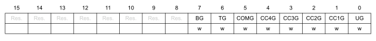

Бит 15-8: Зарезервированы.

Бит 7 `BG`: Генерация аварии
Этот бит устанавливается программным обеспечением для генерации события, он автоматически очищается
аппаратным обеспечением.
- `0`: Никаких действий 
- `1`: Генерируется событие аварии. Бит `MOE` очищен и установлен флаг `BIF`. Связанное прерывание или 
Передача DMA может происходить, если она включена.

Бит 6 `TG`: Генерация триггера  
Этот бит устанавливается программным обеспечением для генерации события, он автоматически очищается
аппаратным обеспечением.
- `0`: Никаких действий 
- `1`: Флаг `TIF` установлен в регистре `TIMx_SR`. Если включено, может произойти соответствующее прерывание или передача `DMA`.

Бит 5 `COMG`: Генерация обновлений управления захватом/сравнением
Этот бит может быть установлен программным обеспечением, он автоматически очищается аппаратным обеспечением
- `0`: Никаких действий 
- `1`: Когда установлен бит `CCPC`, он позволяет обновлять биты `CCxE`, `CCxNE` и `OCxM`
Примечание: Этот бит действует только на каналы, имеющие дополнительный выход.

Бит 4 `CC4G`: Захват / Сравнение 4 поколения
Обратитесь к описанию `CC1G`

Бит 3 `CC3G`: Захват / Сравнение 3 поколения
Обратитесь к описанию `CC1G`

Бит 2 `CC2G`: Захват / Сравнение 2 поколения
Обратитесь к описанию `CC1G`

Бит 1 `CC1G`: Захват/Сравнение 1 поколения
Этот бит устанавливается программным обеспечением для генерации события, он автоматически очищается
аппаратным обеспечением.
 - `0`: Никаких действий 
 - `1`: Событие захвата/сравнения генерируется на канале 1:
Если канал CC1 настроен как выходной: 
Если установлен флаг CC1, отправляется соответствующий запрос прерывания или DMA, если он включен. 
Если канал CC1 настроен в качестве входного: 
Текущее значение счетчика записывается в регистр TIMx_CCR1. Установлен флаг
CC1IF, если он включен, отправляется соответствующее прерывание или запрос DMA. Флаг CC1OF устанавливается, если
флаг CC1IF уже был высоким.

Бит 0 `UG`: Генерация обновлений
Этот бит может быть установлен программным обеспечением, он автоматически очищается аппаратным обеспечением.
- `0`: Никаких действий 
- `1`: Повторно инициализируйте счетчик и сгенерируйте обновление регистров. Обратите внимание, что
счетчик прескалеров тоже очищен (в любом случае на коэффициент прескалеров это не влияет). Счетчик очищается, если
выбран режим выравнивания по центру или если DIR=0 (увеличение), в противном случае он принимает значение автоматической перезагрузки
(TIMx_ARR), если DIR=1 (уменьшение).

---
## TIM1 режим захвата/сравнения регистр 1 CCMR1

TIM1 capture/compare mode register 1   (TIM1->CCMR1)

Смещение адреса: `0x18`

Значение после сброса: `0x0000`

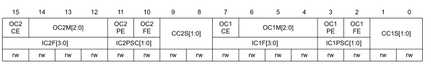

> :bulb: **Примечание:**Каналы могут использоваться как на входе (режим захвата), так и на выходе (режим сравнения). 
Направление канала определяется путем настройки соответствующих битов CCxS. Все остальные
биты этого регистра выполняют разные функции в режиме ввода и в режиме вывода. Для данного бита, 
OCxx описывает свою функцию, когда канал настроен в выводе, ICxx описывает свою функция, когда канал настроен на входе. Поэтому вы должны позаботиться о том, чтобы один и тот же бит
мог иметь разное значение для входного каскада и для выходного каскада.  

---  

#### **Режим сравнения выходных данных**

Бит 15 `OC2CE`: Сравнение выходных данных 2 включить очищение 

Биты 14:12 `OC2M[2:0]`: Режим сравнения выходных данных 2  

Бит 11 `OC2PE`: Выходное сравнение 2 включение предварительной загрузки  

Бит 10 `OC2FE`: Быстрое включение сравнения выходных данных 2  

Биты 9-8 `CC2S[1:0]`: Захват/сравнение 2 выбора  

Это битовое поле определяет направление канала (ввод/вывод), а также используемый ввод.   
- `00`: Канал `CC2` настроен как выходной 
- `01`: Канал `CC2` настроен в качестве входного, IC2 отображается на TI2 
- `10`: Канал `CC2` настроен в качестве входного, IC2 отображается на TI1 
- `11`: Канал `CC2` настроен в качестве входного сигнала, IC2 отображается на TRC. Этот режим работает только в том случае, если
внутренний вход триггера выбран через бит TS (регистр TIMx_SMCR)
Примечание: Биты CC2S доступны для записи только тогда, когда канал выключен (CC2E = ‘0’ в TIMx_CCER).

Бит 7 `OC1CE`: Выходное сравнение 1 включить очищение 
OC1CE: Выходное сравнение 1 Очистить Включить  
- `0`: OC1Ref не зависит от ввода ETRF 
- `1`: OC1Ref очищается, как только на входе ETRF обнаруживается высокий уровень

Биты 6:4 `OC1M`: Режим сравнения выходных данных 1
Эти биты определяют поведение выходного опорного сигнала `OC1REF`, из которого `OC1` и 
`OC1N` являются производными. `OC1REF` является активным высоким, тогда как активный уровень `OC1` и `OC1N` зависит от 
Биты `CC1P` и `CC1NP`.
- `000`: Заморожено - Сравнение между регистром сравнения выходных данных `TIMx_CCR1` и
счетчиком `TIMX_CNT` не влияет на выходные данные (этот режим используется для создания базы синхронизации
). 
- `001`: Установите канал 1 на активный уровень при совпадении. Сигнал OC1REF принудительно повышается, когда счетчик 
`TIMX_CNT` соответствует регистру захвата/сравнения 1 (`TIMx_CCR1`). 
- `010`: Установите канал 1 на неактивный уровень при совпадении. Сигнал `OC1REF` принудительно понижается, когда
счетчик `TIMX_CNT` совпадает с регистром захвата/сравнения 1 (`TIMx_CCR1`). 
- `011`: Переключатель - `OC1REF` переключается, когда `TIMX_CNT=TIMx_CCR1`. 
- `100`: Принудительно неактивный уровень - `OC1REF` принудительно низкий. 
- `101`: Принудительный активный уровень - `OC1REF` принудительно высокий. 
- `110`: Режим ШИМ 1 - При подсчете канал 1 активен до тех пор, пока `timx_cnt < TIMx_CCR1 `
остальное неактивно. При понижающем подсчете канал 1 неактивен (`OC1REF=‘0’`) до тех пор, пока 
`TIMX_CNT > TIMx_CCR1` еще активен (`OC1REF=’1’`). 
- `111`: Режим ШИМ 2 - При подсчете канал 1 неактивен до тех пор, пока `timx_cnt<TIMx_CCR1 `
остальное активно. При понижающем подсчете канал 1 активен до тех пор, пока `TIMX_CNT>TIMx_CCR1` еще
неактивен.
> :bulb: **Примечание:** 
> - 1: Эти биты не могут быть изменены до тех пор, пока не будет запрограммирован уровень блокировки 3 
(Биты БЛОКИРОВКИ в регистре TIMx_BDTR) и CC1S=’00’ (канал настроен на
выходе).
> - 2: В режиме PWM 1 или 2 уровень OCREF изменяется только тогда, когда
изменяется результат сравнения или когда режим сравнения выходных данных переключается из “замороженного” режима
в режим “PWM”.
 
>  - 3: На каналах, имеющих дополнительный выход, это битовое поле предварительно загружено. Если
бит CCPC установлен в регистре TIMx_CR2, то активные биты OC1M принимают новое значение из
предварительно загруженных битов только при генерации COM-события.

Бит 3 `OC1PE`: Выходное сравнение 1 включение предварительной нагрузки
- `0`: Регистр предварительной загрузки на TIMx_CCR1 отключен. TIMx_CCR1 может быть записан в любое время,
новое значение учитывается немедленно. 
- `1`: Регистр предварительной загрузки на TIMx_CCR1 включен. Операции чтения/записи
обращаются к регистру предварительной загрузки. Значение предварительной загрузки TIMx_CCR1 загружается в активный регистр при каждом событии обновления.
> :bulb: **Примечание:** 
> - 1: Эти биты не могут быть изменены до тех пор, пока не будет запрограммирован уровень блокировки 3 
(Биты БЛОКИРОВКИ в регистре TIMx_BDTR) и CC1S=’00’ (канал настроен на
выходе).
> - 2: Режим PWM можно использовать без проверки регистра предварительной нагрузки только в одном
импульсном режиме (бит OPM установлен в регистре TIMx_CR1). В противном случае поведение не гарантируется.

Бит 2 `OC1FE`: Быстрое включение выходного сравнения 1
Этот бит используется для ускорения воздействия события на триггер при вводе на выходе CC.
- `0`: CC1 ведет себя нормально в зависимости от значений счетчика и CCR1, даже когда триггер 
ВКЛ. Минимальная задержка для активации выхода CC1 при возникновении границы на входе триггера составляет 
5 тактовых циклов. 
- `1`: Активное ребро на входе триггера действует как сопоставление сравнения на выходе CC1. Затем OC
устанавливается на уровень сравнения независимо от результата сравнения. Задержка для выборки
входного сигнала триггера и активации выхода CC1 сокращается до 3 тактов. OCFE действует только в том случае, если
канал настроен в режиме PWM1 или PWM2.  

---

  ### **Режим захвата входного сигнала**

Биты `1-0` CC1S: Захват/сравнение 1 выборки
Это битовое поле определяет направление канала (ввод/вывод), а также используемый ввод.
- `00`: Канал CC1 настроен как выходной
- `01`: Канал CC1 настроен в качестве входного, IC1 отображается на TI1
- `10`: Канал CC1 настроен в качестве входного, IC1 отображается на TI2
- `11`: Канал CC1 настроен в качестве входного сигнала, IC1 отображается на TRC. Этот режим работает только в том случае, если
внутренний вход триггера выбран через бит TS (регистр TIMx_SMCR).
Примечание: Биты CC1S доступны для записи только тогда, когда канал выключен (CC1E = ‘0’ в TIMx_CCER).

Биты 15-12 `IC2F`: Фильтр захвата входного сигнала 2  

Биты 11-10 `IC2PSC[1:0]`: Предварительный просмотр ввода 2  
Биты 9-8 `CC2S`: Захват/ сравнение 2 выбора
Это битовое поле определяет направление канала (ввод/вывод), а также используемый ввод.
- `00`: Канал CC2 настроен как выходной
- `01`: Канал CC2 настроен в качестве входного, IC2 отображается на TI2
- `10`: Канал CC2 настроен в качестве входного, IC2 отображается на TI1
- `11`: Канал CC2 настроен в качестве входного сигнала, IC2 отображается на TRC. Этот режим работает только в том случае, если
внутренний вход триггера выбран через бит TS (регистр TIMx_SMCR).
Примечание: Биты CC2S доступны для записи только тогда, когда канал выключен (CC2E = ‘0’ в TIMx_CCER).

Биты 7-4 `IC1F[3:0]`: Входной фильтр захвата 1
Это битовое поле определяет частоту, используемую для выборки входного сигнала TI1, и длину цифрового фильтра, применяемого к
ТИ1. Цифровой фильтр состоит из счетчика событий, в котором для проверки перехода на выходе требуется N последовательных событий:
- `0000`: Фильтра нет, выборка производится в fDTS
- `0001`: fsampling = fCK_INT, N = 2
- `0010`: fsampling = fCK_INT, N = 4
- `0011`: fsampling = fCK_INT, N = 8
- `0100`: Выборка FS = FDTS / 2, N = 6
- `0101`: Выборка FS = FDTS / 2, N = 8
- `0110`: Выборка FS = FDTS / 4, N = 6
- `0111`: Выборка FS = FDTS / 4, N = 8
- `1000`: fSAMPLING = FDTS / 8, N = 6
- `1001`: fSAMPLING = FDTS / 8, N = 8
- `1010`: fSAMPLING = FDTS / 16, N = 5
- `1011`: Выборка FS = FDTS / 16, N = 6
- `1100`: Выборка FS = FDTS / 16, N = 8
- `1101`: Выборка FS = FDTS / 32, N = 5
- `1110`: fSAMPLING = FDTS / 32, N = 6
- `1111`: fSAMPLING = FDTS / 32, N = 8
> :bulb: **Примечание:** Необходимо позаботиться о том, чтобы f
DTS
заменяется в формуле на CK_INT, когда ICXF[3:0] = 1, 2 или 3.

Биты 3-2 `IC1PSC`: Входной захват 1 прескалер
Это битовое поле определяет коэффициент прескалера, действующего на вход CC1 (IC1).
Предварительный счетчик сбрасывается, как только CC1E=’0’ (регистр TIMx_CCER).
- `00`: нет прескалера, захват выполняется каждый раз, когда на входе захвата обнаруживается ребро
- `01`: захват выполняется один раз каждые 2 события
- `10`: захват выполняется один раз каждые 4 события
- `11`: захват выполняется один раз каждые 8 событий

Биты 1-0 `CC1S`: Захват/Сравнение 1 выборки
Это битовое поле определяет направление канала (ввод/вывод), а также используемый ввод. 
- `00`: Канал CC1 настроен как выходной 
- `01`: Канал CC1 настроен в качестве входного, IC1 отображается на TI1 
- `10`: Канал CC1 настроен в качестве входного, IC1 отображается на TI2 
- `11`: Канал CC1 настроен в качестве входного сигнала, IC1 отображается на TRC. Этот режим работает только в том случае, если
внутренний вход триггера выбран через бит TS (регистр TIMx_SMCR).
Примечание: Биты CC1S доступны для записи только тогда, когда канал выключен (CC1E = ‘0’ в TIMx_CCER).

---
## TIM1 режим захвата/сравнения регистр 2 CCMR2

TIM1 capture/compare mode register 2   (TIM1->CCMR2)

Смещение адреса: `0x1C`

Значение после сброса: `0x0000`

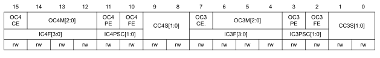

> :bulb: **Примечание:**Каналы могут использоваться как на входе (режим захвата), так и на выходе (режим сравнения). 
Направление канала определяется путем настройки соответствующих битов CCxS. Все остальные
биты этого регистра выполняют разные функции в режиме ввода и в режиме вывода. Для данного бита, 
OCxx описывает свою функцию, когда канал настроен в выводе, ICxx описывает свою функция, когда канал настроен на входе. Поэтому вы должны позаботиться о том, чтобы один и тот же бит
мог иметь разное значение для входного каскада и для выходного каскада.
--- 
### **Режим сравнения выходных данных**

Бит 15 `OC4CE`: Выходное сравнение 4 очистить включить  

Биты 14:12 `OC4M`: Режим сравнения выходных данных 4  

Бит 11 `OC4PE`: Выходное сравнение 4 включение предварительной нагрузки  

Бит 10 `OC4FE`: Быстрое включение сравнения выходных данных 4  

Биты 9-8 `CC4S`: Захват / сравнение 4 выбора  

Это битовое поле определяет направление канала (ввод/вывод), а также используемый ввод. 
- `00`: Канал CC4 настроен как выходной 
- `01`: Канал CC4 настроен в качестве входного, IC4 отображается на TI4 
- `10`: Канал CC4 настроен в качестве входного сигнала, IC4 отображается на TI3 
- `11`: Канал CC4 настроен в качестве входного сигнала, IC4 отображается на TRC. Этот режим работает только в том случае, если
внутренний вход триггера выбран через бит TS (регистр TIMx_SMCR).
Примечание: Биты CC4S доступны для записи только тогда, когда канал выключен (CC4E = ‘0’ в TIMx_CCER).

Бит 7 `OC3CE`: Выходное сравнение 3 очистить включить  

Биты 6:4 `OC3M`: Режим сравнения выходных данных 3  

Бит 3 `OC3PE`: Выходное сравнение 3 включение предварительной загрузки  

Бит 2 `OC3FE`: Быстрое включение сравнения выходных данных 3  

Биты 1:0 `CC3S`: Захват/ сравнение 3 выбора  
Это битовое поле определяет направление канала (вход/выход).  

---
### **Режим захвата входного сигнала**

Биты 15-12 `IC4F`: Фильтр захвата входного сигнала 4  

Биты 11-10 `IC4PSC`: Предварительный анализатор захвата входного сигнала 4  

Биты 9-8 `CC4S`: Захват / сравнение 4 выбора
Это битовое поле определяет направление канала (ввод/вывод), а также используемый ввод. 
- `00`: Канал CC4 настроен как выходной 
- `01`: Канал CC4 настроен в качестве входного, IC4 отображается на TI4 
- `10`: Канал CC4 настроен в качестве входного сигнала, IC4 отображается на TI3 
- `11`: Канал CC4 настроен в качестве входного сигнала, IC4 отображается на TRC. Этот режим работает только в том случае, если
внутренний вход триггера выбран через бит TS (регистр TIMx_SMCR).
Примечание: Биты CC4S доступны для записи только тогда, когда канал выключен (CC4E = ‘0’ в TIMx_CCER).

Биты 7-4 `IC3F`: Фильтр захвата входного сигнала 3
Биты 3-2 `IC3PSC`: Входной захват 3 прескалера
Биты 1-0 `CC3S`: Захват/ сравнение 3 выбора
Это битовое поле определяет направление канала (ввод/вывод), а также используемый ввод. 
- `00`: Канал CC3 настроен как выходной 
- `01`: Канал CC3 настроен в качестве входного, IC3 отображается на TI3 
- `10`: Канал CC3 настроен в качестве входного, IC3 отображается на TI4 
- `11`: Канал CC3 настроен в качестве входного сигнала, IC3 отображается на TRC. Этот режим работает только в том случае, если
внутренний вход триггера выбран через бит TS (регистр TIMx_SMCR).

> :bulb: **Примечание:** 
> Биты CC3S доступны для записи только тогда, когда канал выключен (CC3E = ‘0’ в TIMx_CCER).

---
## Регистр включения захвата/сравнения TIM1 

TIM1 capture/compare enable register   (TIM1->CCER)

Смещение адреса: `0x20`

Значение после сброса: `0x0000`

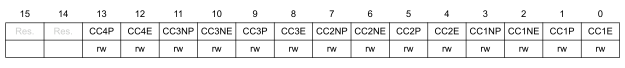

Биты 15-14 зарезервированы, должны быть сохранены на сброшенном значении.  

Бит 13 `CCP`: Захват/сравнение 4 выходных полярностей
см. описание CC1P  

Бит 12 `CC4E`: Захват/сравнение 4 выходных данных для включения
см. описание CC1E  

Бит 11 `CCNP`: Захват / сравнение 3 дополнительных выходных полярностей
см. описание CC1P  

Бит 10 `CC3NE`: Захват/сравнение 3 дополнительных выходных данных для включения  
см. Описание CCNE  

Бит 9 `CCP`: Захват / сравнение 3 выходных полярностей
см. описание CC1P  

Бит 8 `CC3E`: Захват/ сравнение 3 выходных данных для включения
см. описание CC1E  

Бит 7 `CC2NP`: Захват / сравнение 2 дополнительных выходных полярностей
см. описание CC1NP  

Бит 6 `CC2NE`: Захват/ сравнение 2 дополнительных выходных данных для включения  

Бит 5 `CC2P`: Захват / сравнение 2 выходных полярностей
см. описание CC1P  

Бит 4 `CC2E`: Захват/сравнение 2 выходных данных для включения
см. описание CC1E  

Бит 3 `CC1NP`: Захват / сравнение 1 дополнительной выходной полярности  
Конфигурация канала CC1 в качестве выходного сигнала:  
- `0`: активный максимум OC1N. 
- `1`: Активный низкий уровень OC1N.  

Конфигурация канала CC1 в качестве входного сигнала:
Этот бит используется совместно с CC1P для определения полярности TI1FP1 и TI2FP1. Ссылаться на 
Описание CC1P.
Примечание: На каналах, имеющих дополнительный выход, этот бит предварительно загружен. Если бит
CCPC установлен в регистре TIMx_CR2, то активный бит CC1NP принимает новое значение из
предварительно загруженных битов только тогда, когда генерируется событие коммутации.
> :bulb: **Примечание:**  Этот бит недоступен для записи, как только запрограммирован уровень БЛОКИРОВКИ 2 или 3 (биты БЛОКИРОВКИ
в регистре TIMx_BDTR) и CC1S=”00” (канал настроен в выводе).
Бит 2 CC1NE: Захват / сравнение 1 дополнительного выходного сигнала позволяет
- `0`: Выкл. - OC1N не активен. Уровень OC1N затем является функцией битов MOE, OSSI, OSSR, OIS1, OIS1N
и CC1E. 
- `1`: Сигнал On - OC1N выводится на соответствующий выходной вывод в зависимости от битов MOE, OSSI,
OSSR, OIS1, OIS1N и CC1E.  
> :bulb: **Примечание:** На каналах, имеющих дополнительный выход, этот бит предварительно загружен. Если бит
CCPC установлен в регистре TIMx_CR2, то активный бит CC1NE принимает новое значение из
предварительно загруженных битов только тогда, когда генерируется событие коммутации.

Бит 1 `CC1P`: Захват/Сравнение 1 выходной полярности
Канал CC1, сконфигурированный как выходной:
- `0`: активный максимум OC1 
- `1`: Активный низкий уровень OC1

---
 ### **Канал CC1, настроенный в качестве входного:**  

Биты CC1NP/CC1P выбирают активную полярность TI1FP1 и TI2FP1 для операций запуска или захвата.
- `00`: не перевернутый/восходящий край
Схема чувствительна к восходящему фронту TIxFP1 (операции захвата или запуска в режиме сброса, внешнего
синхронизации или запуска), TIxFP1 не инвертирован (операция запуска в режиме стробирования или режиме кодирования
).  

- `01`: перевернутый/падающий край
Схема чувствительна к падающему фронту TIxFP1 (операции захвата или запуска при сбросе, внешнем
тактовый или триггерный режим), TIxFP1 инвертируется (срабатывание триггера в стробированном режиме или
режиме кодирования).  
- `10`: зарезервировано, не используйте эту конфигурацию.
- `11`: не перевернутый / оба края
Схема чувствительна как к восходящим, так и к нисходящим фронтам TIxFP1 (операции захвата или запуска
в режиме сброса, внешнего синхронизации или запуска), TIxFP1 не инвертирован (операция запуска в закрытом
режиме). Эта конфигурация не должна использоваться в режиме кодировщика.
Примечание: На каналах, имеющих дополнительный выход, этот бит предварительно загружен. Если бит
CCPC установлен в регистре TIMx_CR2, то активный бит CC1P принимает новое значение из 
предварительно загруженные биты только тогда, когда генерируется событие коммутации.
Примечание: Этот бит недоступен для записи, как только запрограммирован уровень блокировки 2 или 3 (биты БЛОКИРОВКИ
в регистре TIMx_BDTR).

Бит 0 `CC1E`: Захват / сравнение 1 выходного сигнала позволяет
Канал CC1, сконфигурированный как выходной:  
- `0`: Выкл. - OC1 не активен. Уровень OC1 затем является функцией битов MOE, OSSI, OSSR, OIS1, OIS1N и CC1NE.   
- `1`: Сигнал On - OC1 выводится на соответствующий выходной вывод в зависимости от битов MOE, OSSI, OSSR, OIS1, OIS1N и CC1NE.  
Канал CC1, настроенный в качестве входного:  
Этот бит определяет, действительно ли можно записать значение счетчика во входной регистр захвата/сравнения 1 (TIMx_CCR1) или нет.  
- `0`: Захват отключен. 
- `1`: Захват включен.
> :bulb: **Примечание:**  На каналах, имеющих дополнительный выход, этот бит предварительно загружен. Если бит
CCPC установлен в регистре TIMx_CR2, то активный бит CC1E принимает новое значение из
предварительно загруженных битов только тогда, когда генерируется событие коммутации.

---
## Счетчик TIM1 

TIM1 counter  (TIM1->CNT)

Смещение адреса: `0x24`

Значение после сброса: `0x0000`

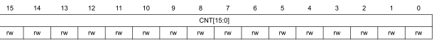

Биты 15:0 `CNT[15:0]`: Значение счетчика

---
## Счетчик TIM1 

TIM1 counter  (TIM1->CNT)

Смещение адреса: `0x24`

Значение после сброса: `0x0000`

Биты 15:0 `CNT[15:0]`: Значение счетчика

---

## Предделитель TIM1

TIM1 prescaler (TIM1->PSC)

Смещение адреса: `0x28`

Значение после сброса: `0x0000`

Биты 15:0 `PSC[15:0]`: Значение предделителя  
 - Тактовая частота счетчика (CK_CNT) равна f CK_PSC / (PSC[15:0] + 1).
PSC содержит значение, которое должно быть загружено в активный регистр прескалера при каждом событии обновления
((в том числе, когда счетчик очищается с помощью UG-бита регистра Time_EGR или с помощью
контроллера триггера при настройке в “режиме сброса”).

---

## Регистр автоматической перезагрузки TIM1 

TIM1 prescaler (TIM1->ARR)

Смещение адреса: `0x28`

Значение после сброса: `0x0000`

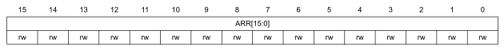

Биты 15:0 `ARR[15:0]`: Значение автоматической перезагрузки  
- ARR - это значение, которое будет загружено в фактический регистр автоматической перезагрузки.
Обратитесь к разделу 17.3.1: Базовая единица измерения времени на стр. 322 для получения более подробной информации об обновлении
и поведении ARR.
Счетчик блокируется, пока значение автоматической перезагрузки равно нулю.

---

## Регистр счетчика повторений TIM1 

TIM1 repetition counter register (TIM1->RCR)

Смещение адреса: `0x30`

Значение после сброса: `0x0000`

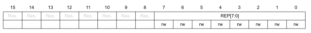

Биты 15:8 зарезервированы, должны быть сохранены на сброшенном значении.  

Биты 7:0 `REP[7:0]`: Значение счетчика повторений
Эти биты позволяют пользователю настраивать частоту обновления регистров сравнения (т.е. периодические
переходы от предварительной загрузки к активным регистрам), когда регистры предварительной загрузки включены, а также
частоту генерации прерываний обновления, если это прерывание включено.
Каждый раз, когда счетчик, связанный с REP_CNT, достигает нуля, генерируется событие обновления
, и оно перезапускает отсчет со значения REP. Поскольку REP_CNT перезагружается со значением REP только в 
событие обновления повторения U_RC, любая запись в регистр Time_RCR не учитывается до
следующего события обновления повторения.
Это означает, что в режиме PWM (REP +1) соответствует:
- количество периодов ШИМ в режиме выравнивания по краям
- количество половинных периодов ШИМ в режиме выравнивания по центру.

---
## TIM1 регистр захвата/сравнения 1

TIM1 capture/compare register 1 (TIM1->CCR1)

Смещение адреса: `0x34`

Значение после сброса: `0x0000`

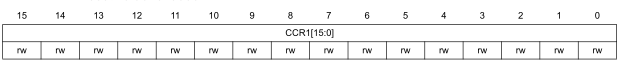

Биты 15:0 `CCR1[15:0]`: Захват/Сравнение 1 значения
**Если канал CC1 настроен как выходной:**   
CCR1 - это значение, которое должно быть загружено в фактический регистр захвата/сравнения 1 (значение предварительной загрузки).
Он загружается постоянно, если функция предварительной загрузки не выбрана в регистре TIMx_CCMR1 (бит 
OC1PE). В противном случае значение предварительной загрузки копируется в активный регистр захвата/сравнения 1 при возникновении
события обновления.
Активный регистр захвата/сравнения содержит значение, подлежащее сравнению со счетчиком 
TIMx_CNT и сигнализируется на выходе OC1. 
 
**Если канал CC1 настроен в качестве входного:**   
CCR1 - это значение счетчика, переданное последним событием захвата ввода 1 (IC1).

---

## TIM1 регистр захвата/сравнения 2

TIM1 capture/compare register 2 (TIM1->CCR2)

Смещение адреса: `0x38`

Значение после сброса: `0x0000`

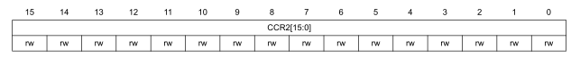

Биты 15:0 `CCR2[15:0]`: Захват/Сравнение 2 значения  
**Если канал CC2 настроен как выходной:**   
CCR2 - это значение, которое должно быть загружено в фактический регистр захвата/сравнения 2 (значение предварительной загрузки).
Он загружается постоянно, если функция предварительной загрузки не выбрана в регистре TIMx_CCMR2 (бит 
OC2PE). В противном случае значение предварительной загрузки копируется в активный регистр захвата/сравнения 2 при возникновении
события обновления.
Активный регистр захвата/сравнения содержит значение, подлежащее сравнению со счетчиком 
TIMx_CNT и сигнализируется на выходе OC2. 
 
**Если канал CC2 настроен в качестве входного:**   
CCR2 - это значение счетчика, переданное последним событием захвата ввода 2 (IC2).

---
## TIM1 регистр захвата/сравнения 3

TIM1 capture/compare register 3 (TIM1->CCR3)

Смещение адреса: `0x3C`

Значение после сброса: `0x0000`

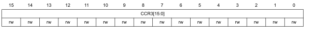

Биты 15:0 `CCR3[15:0]`: Захват/Сравнение 3 значения
**Если канал CC3 настроен как выходной:**   
CCR3 - это значение, которое должно быть загружено в фактический регистр захвата/сравнения 3 (значение предварительной загрузки).
Он загружается постоянно, если функция предварительной загрузки не выбрана в регистре TIMx_CCMR3 (бит 
OC3PE). В противном случае значение предварительной загрузки копируется в активный регистр захвата/сравнения 3 при возникновении
события обновления.
Активный регистр захвата/сравнения содержит значение, подлежащее сравнению со счетчиком 
TIMx_CNT и сигнализируется на выходе OC3. 
 
**Если канал CC3 настроен в качестве входного:**   
CCR3 - это значение счетчика, переданное последним событием захвата ввода 3 (IC3.

---

## TIM1 регистр захвата/сравнения 4

TIM1 capture/compare register 4 (TIM1->CCR4)

Смещение адреса: `0x40`

Значение после сброса: `0x0000`

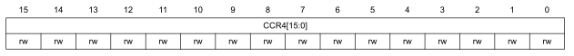

Биты 15:0 `CCR4[15:0]`: Захват/Сравнение 4 значения
**Если канал CC4 настроен как выходной:**   
CCR4 - это значение, которое должно быть загружено в фактический регистр захвата/сравнения 4 (значение предварительной загрузки).
Он загружается постоянно, если функция предварительной загрузки не выбрана в регистре TIMx_CCMR4 (бит 
OC4PE). В противном случае значение предварительной загрузки копируется в активный регистр захвата/сравнения 4 при возникновении
события обновления.
Активный регистр захвата/сравнения содержит значение, подлежащее сравнению со счетчиком 
TIMx_CNT и сигнализируется на выходе OC4. 
 
**Если канал CC4 настроен в качестве входного:**   
CCR4 - это значение счетчика, переданное последним событием захвата ввода 4 (IC4).

---
## TIM1 авария и регистр мертвого времени

TIM1 break and dead-time register (TIM1-> BDTR)

Смещение адреса: `0x44`

Значение после сброса: `0x0000`

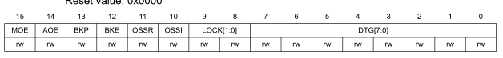

> :bulb: **Примечание:** Поскольку биты AOE, BKP, BKE, OSSI, OSSR и DTG[7:0] могут быть заблокированы для записи в зависимости от
конфигурации БЛОКИРОВКИ, может потребоваться настроить их все во время первого
доступа на запись к регистру TIMx_BDTR.

Бит 15 `MOE`: Включение основного вывода
Этот бит очищается асинхронно аппаратным обеспечением, как только активируется ввод break. Он устанавливается
программным обеспечением или автоматически в зависимости от бита AOE. Он действует только на те каналы, которые
настроены на выходе.
- `0`: Выходы OC и OCN отключены или переведены в режим ожидания. 
- `1`: Выходы OC и OCN включены, если установлены их соответствующие разрешающие биты (CCxE, CCxNE в 
Регистр TIMx_CCER). 
Смотрите описание включения OC/OCN для получения более подробной информации (Раздел 17.4.9: Регистр включения захвата/сравнения
TIM1 (TIM1_CCER) на стр. 381).

Бит 14 `AOE`: включение автоматического вывода
- `0`: MOE может быть установлен только с помощью программного обеспечения 
- `1`: MOE может быть установлен программным обеспечением или автоматически при следующем событии обновления (если ввод break
не активен)
Примечание: Этот бит не может быть изменен до тех пор, пока не будет запрограммирован уровень блокировки 1 (биты БЛОКИРОВКИ
в регистре TIMx_BDTR).  

Бит 13 `BKP`: Разрыв полярности
- `0`: Вход Break BRK активен на низком уровне 
- `1`: Вход разрыва BRK активен на высоком уровне
Примечание: Этот бит не может быть изменен до тех пор, пока не будет запрограммирован уровень блокировки 1 (биты БЛОКИРОВКИ
в регистре TIMx_BDTR).
Примечание: Для вступления в силу любой операции записи в этот бит требуется задержка в 1 такт APB.

Бит 12 `BKE`: Разрешить аварию
- `0`: Входы прерывания (событие сбоя синхронизации BRK и CCS) отключены 
- `1`; Входы прерывания (событие сбоя синхронизации BRK и CCS) включены
Примечание: Этот бит не может быть изменен, если запрограммирован уровень блокировки 1 (биты блокировки в 
Регистр TIMx_BDTR).
Примечание: Для вступления в силу любой операции записи в этот бит требуется задержка в 1 такт APB.  

Бит 11 `OSSR`: Выбор выключенного состояния для режима выполнения
Этот бит используется, когда MOE=1 на каналах, имеющих дополнительный выход, которые
сконфигурированы как выходы. OSSR не реализуется, если в таймере не реализован дополнительный вывод
. 
См. Описание включения OC/OCN для получения более подробной информации (Раздел 17.4.9: Регистр включения захвата/сравнения  
TIM1 (TIM1_CCER) на стр. 381).
- `0`: Когда неактивно, выходы OC/OCN отключены (выходной сигнал включения OC/OCN =0). 
- `1`: Когда неактивно, выходы OC/ OCN включаются с их неактивным уровнем, как только CCxE=1 
или CCxNE=1. Затем OC/OCN включают выходной сигнал=1
Примечание: Этот бит не может быть изменен, как только будет запрограммирован уровень БЛОКИРОВКИ 2 (
биты БЛОКИРОВКИ в регистре TIMx_BDTR).

Бит 10 `OSSI`: Выбор выключенного состояния для режима ожидания
Этот бит используется, когда MOE=0 на каналах, настроенных как выходы. 
Смотрите описание включения OC/OCN для получения более подробной информации (Раздел 17.4.9: Регистр включения захвата/сравнения
TIM1 (TIM1_CCER) на стр. 381).
- `0`: Когда неактивно, выходы OC/OCN отключены (выходной сигнал включения OC/OCN =0). 
- `1`: В неактивном состоянии выходы OC/OCN сначала принудительно переключаются на уровень холостого хода, как только CCxE=1 или 
CCxNE=1. OC/OCN включить выходной сигнал=1)
Примечание: Этот бит не может быть изменен, как только будет запрограммирован уровень БЛОКИРОВКИ 2 (
биты БЛОКИРОВКИ в регистре TIMx_BDTR).

Биты 9:8 `LOCK[1:0]`: Конфигурация блокировки
Эти биты обеспечивают защиту от записи от программных ошибок.
- `00`: БЛОКИРОВКА ОТКЛЮЧЕНА - Ни один бит не защищен от записи. 
- `01`: Уровень блокировки 1 = биты DTG в регистре TIMx_BDTR, биты OISX и OISXN в TIMx_CR2 
регистр и биты BKE/BKP/AOE в регистре TIMx_BDTR больше не могут быть записаны. 
- `10`: Уровень блокировки 2 = Уровень блокировки 1 + биты полярности CC (биты CCXP/CCxNP в
регистре TIMx_CCER, если соответствующий канал настроен на вывод через биты CCXS), а
также биты OSSR и OSSI больше не могут быть записаны. 
- `11`: Уровень блокировки 3 = Уровень блокировки 2 + Управляющие биты CC (биты OCxM и OCxPE в 
Регистры TIMx_CCMRx, до тех пор, пока соответствующий канал настроен на вывод через 
Биты CCxS) больше не могут быть записаны.
Примечание: Биты БЛОКИРОВКИ могут быть записаны только один раз после сброса. Как только регистр
TIMx_BDTR записан, их содержимое замораживается до следующего сброса  .  

Биты 7:0 `DTG[7:0]`: Настройка генератора мертвого времени
Это битовое поле определяет продолжительность простоя, вставляемого между дополнительными
выходами. DT соответствует этой продолжительности. 

- DTG[7:5]=0xx => DT=DTG[7:0]x tdtg с tdtg=TDTS. 
- DTG[7:5]=10x => DT=(64+DTG[5:0])xtdtg с Tdtg=2xtDTS. 
- DTG[7:5]=110 => DT=(32+DTG[4:0])xtdtg с Tdtg=8XTDTS. 
- DTG[7:5]=111 => DT=(32+DTG[4:0])xtdtg с Tdtg=16xtDTS. 
> :bulb: **Приммер:** если TDTS=125 нс (8 МГц), возможные значения времени простоя составляют: 
от 0 до 15875 нс с шагом 125 нс,
от 16 до 31750 нс с шагом 250 нс, 
от 32 до 63 долларов США с шагом 1 доллар США, 
64 сша до 126 сша на 2 шага США

> :bulb: **Примечание:** Это битовое поле не может быть изменено до тех пор, пока не будет запрограммирован уровень блокировки 1, 2 или 3 
(Биты БЛОКИРОВКИ в регистре TIMx_BDTR).

---

## TIM1 настройки DMA

TIM1 DMA control register (TIM1->DCR)

Смещение адреса: `0x48`

Значение после сброса: `0x0000`

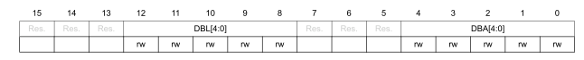

Биты 15:13 зарезервированы, должны быть сохранены на сброшенном значении. 

Биты 12-8 `DBL[4:0]`: длина пакета DMA
Этот 5-битный вектор определяет количество передач DMA (таймер распознает пакетную передачу
, когда выполняется доступ для чтения или записи к адресу Time_DMAR)
- `00000`: 1 перевод 
- `00001`: 2 передачи 
- `00010`: 3 передачи
- `...`   
- `10001`: 18 трансферов  

Биты 7:5 зарезервированы, должны быть сохранены на сброшенном значении.

Биты 4:0 `DBA[4:0]`: базовый адрес DMA

5-битный вектор определяет базовый адрес для передачи DMA (когда доступ для чтения/записи
осуществляется через адрес Time_DMAR). DBA определяется как смещение, начинающееся с адреса 
из регистра TIMx_CR1.
>: Пример:  
00000: TIMx_CR1,   
00001: TIMx_CR2,  
00010: TIMx_SMCR,  
...  

>: Пример:  Давайте рассмотрим следующую передачу: DBL = 7 передач и DBA = TIMx_CR1. В  
этом случае передача выполняется в/из 7 регистров, начиная с адреса TIMx_CR1.  

---

## TIM1 настройки DMA

TIM1 DMA address for full transfer (TIM1->DMAR)

Смещение адреса: `0x4C`

Значение после сброса: `0x0000`

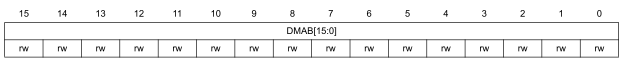

Биты 15:0 `DMAP[15:0]`: регистр DMA для пакетного доступа  
- Операция чтения или записи в регистр DMAR обеспечивает доступ к регистру, расположенному по адресу
(Адрес TIMx_CR1) + (DBA + индекс DMA) x 4 
где адрес TIMx_CR1 - это адрес управляющего регистра 1, DBA - это базовый
адрес DMA, настроенный в регистре TIMEX_DCR, индекс DMA автоматически контролируется
передачей DMA и находится в диапазоне от 0 до DBL (DBL настроен INTIMAX_DCR).  

> **Пример использования функции пакетной передачи DMA**
В этом примере функция пакетирования DMA по таймеру используется для обновления содержимого  
регистров CCRx (x = 2, 3, 4), при этом DMA передает половину слов в регистры CCRx.   
Это делается в следующих шагах:  
> 1. Настройте соответствующий канал DMA следующим образом:   
– Периферийный адрес канала DMA - это адрес регистра DMAR   
– Адрес памяти канала DMA - это адрес буфера в оперативной памяти, содержащего  
данные, которые должны быть переданы DMA в регистры CCRx.   
– Количество передаваемых данных = 3 (см. примечание ниже).   
– Круговой режим отключен.  
>2. Настройте регистр DCR, настроив битовые поля DB и DB следующим образом:  
DBL = 3 передачи, DBA = 0xE. 
>3. Включите запрос TIMx update DMA (установите бит IDE в регистре ДНЕВНИКА). 
>4. Включите Время 
>5. Включите канал DMA

> **Примечание:** Этот пример предназначен для случая, когда каждый регистр CCRx должен обновляться один раз.   
Например, если каждый регистр CCRx должен обновляться дважды, количество передаваемых данных должно быть равно 6. Давайте  
рассмотрим пример буфера в оперативной памяти, содержащего data1, data2, data3, data4, data5 и  
data6. Данные передаются в регистры CCRx следующим образом: при первом обновлении DMA   
запрос, данные 1 передаются в CCR2, данные 2 передаются в CCR3, данные 3 передаются в   
CCR4 и при втором запросе DMA на обновление данные 4 передаются в CCR2, данные 5 передаются   
передается в CCR3, а данные 6 передаются в CCR4.  