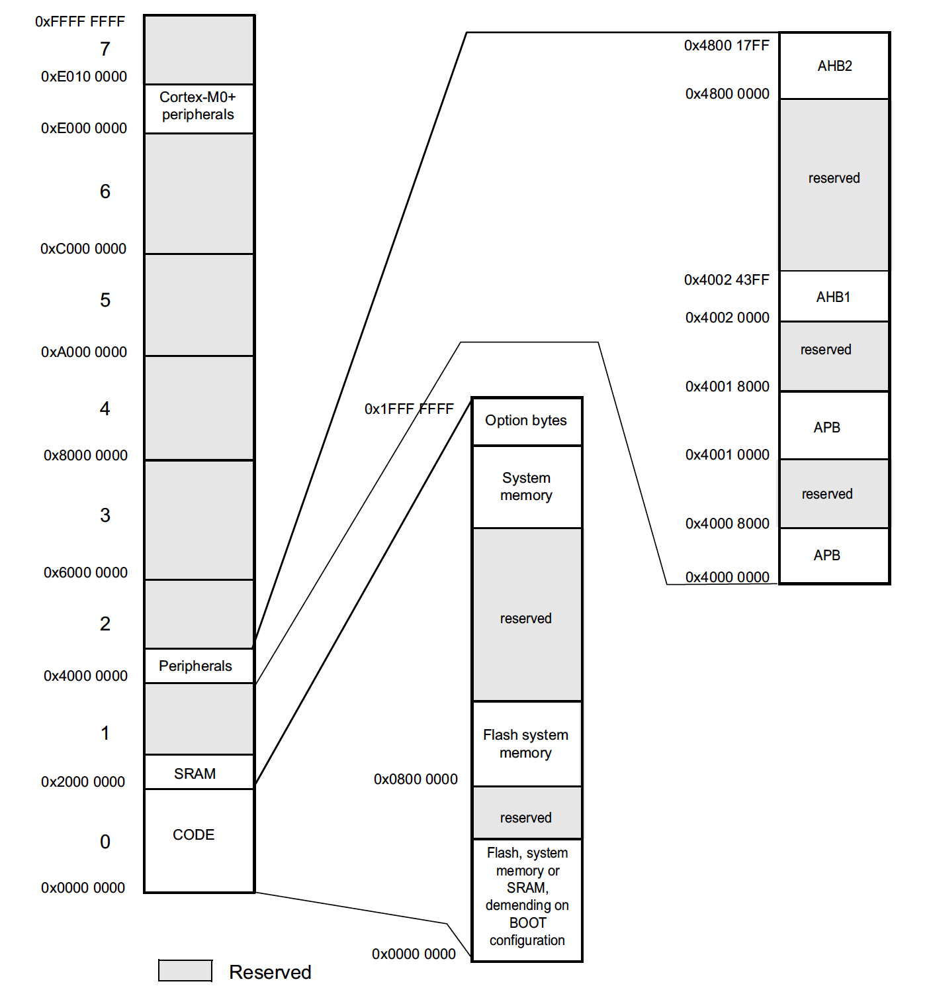

# Карта памяти `stm32f072rbt6`

| Шина | Диапазон адресов | Размер | Периферийный модуль |
| ---- | ---------------- | ------ | ------------------- |
| | `0xE000 0000 - 0xE00F FFFF` | `1MB` | Внутренняя периферия Cortex-M0 |
| | `0x4800 1800 - 0x5FFF FFFF` | `~384 MB` | Зарезервировано |
| AHB2 | `0x4800 1400 - 0x4800 17FF` | `1KB` | `GPIOF` |
| AHB2 | `0x4800 1000 - 0x4800 13FF` | `1KB` | `GPIOE` |
| AHB2 | `0x4800 0C00 - 0x4800 0FFF` | `1KB` | `GPIOD` |
| AHB2 | `0x4800 0800 - 0x4800 0BFF` | `1KB` | `GPIOC` |
| AHB2 | `0x4800 0400 - 0x4800 07FF` | `1KB` | `GPIOB` |
| AHB2 | `0x4800 0000 - 0x4800 03FF` | `1KB` | `GPIOA` |
| | `0x4002 4400 - 0x47FF FFFF` | `~128 MB` | Зарезервировано |
| AHB1 | `0x4002 4000 - 0x4002 43FF` | `1KB` | `TSC` |
| AHB1 | `0x4002 3400 - 0x4002 3FFF` | `3KB` | Зарезервировано |
| AHB1 | `0x4002 3000 - 0x4002 33FF` | `1KB` | `CRC`
| AHB1 | `0x4002 2400 - 0x4002 2FFF` | `3KB` | Зарезервировано |
| AHB1 | `0x4002 2000 - 0x4002 23FF` | `1KB` | `FLASH interface` |
| AHB1 | `0x4002 1400 - 0x4002 1FFF` | `3KB` | Зарезервировано |
| AHB1 | `0x4002 1000 - 0x4002 13FF` | `1KB` | `RCC` |
| AHB1 | `0x4002 0800 - 0x4002 0FFF` | `2KB` | Зарезервировано |
| AHB1 | `0x4002 0400 - 0x4002 07FF` | `1KB` | `DMA2` |
| AHB1 | `0x4002 0000 - 0x4002 03FF` | `1KB` | `DMA` |
| | `0x4001 8000 - 0x4001 FFFF` | `32KB` | Зарезервировано |
| APB | `0x4001 5C00 - 0x4001 7FFF` | `9KB` | Зарезервировано |
| APB | `0x4001 5800 - 0x4001 5BFF` | `1KB` | `DBGMCU` |
| APB | `0x4001 4C00 - 0x4001 57FF` | `3KB` | Зарезервировано |
| APB | `0x4001 4800 - 0x4001 4BFF` | `1KB` | `TIM17` |
| APB | `0x4001 4400 - 0x4001 47FF` | `1KB` | `TIM16` |
| APB | `0x4001 4000 - 0x4001 43FF` | `1KB` | `TIM15` |
| APB | `0x4001 3C00 - 0x4001 3FFF` | `1KB` | Зарезервировано |
| APB | `0x4001 3800 - 0x4001 3BFF` | `1KB` | `USART1` |
| APB | `0x4001 3400 - 0x4001 37FF` | `1KB` | Зарезервировано |
| APB | `0x4001 3000 - 0x4001 33FF` | `1KB` | `SPI1/I2S1` |
| APB | `0x4001 2C00 - 0x4001 2FFF` | `1KB` | `TIM1` |
| APB | `0x4001 2800 - 0x4001 2BFF` | `1KB` | Зарезервировано |
| APB | `0x4001 2400 - 0x4001 27FF` | `1KB` | `ADC` |
| APB | `0x4001 2000 - 0x4001 23FF` | `1KB` | Зарезервировано |
| APB | `0x4001 1C00 - 0x4001 1FFF` | `1KB` | `USART8` |
| APB | `0x4001 1800 - 0x4001 1BFF` | `1KB` | `USART7` |
| APB | `0x4001 1400 - 0x4001 17FF` | `1KB` | `USART6` |
| APB | `0x4001 0800 - 0x4001 13FF` | `3KB` | Зарезервировано |
| APB | `0x4001 0400 - 0x4001 07FF` | `1KB` | `EXTI` |
| APB | `0x4001 0000 - 0x4001 03FF` | `1KB` | `SYSCFG COMP` |
| | `0x4000 8000 - 0x4000 FFFF` | `32KB` | Зарезервировано |
| APB | `0x4000 7C00 - 0x4000 7FFF` | `1KB` | Зарезервировано |
| APB | `0x4000 7800 - 0x4000 7BFF` | `1KB` | `CEC` |
| APB | `0x4000 7400 - 0x4000 77FF` | `1KB` | `DAC` |
| APB | `0x4000 7000 - 0x4000 73FF` | `1KB` | `PWR` |
| APB | `0x4000 6C00 - 0x4000 6FFF` | `1KB` | `CRS` |
| APB | `0x4000 6800 - 0x4000 6BFF` | `1KB` | Зарезервировано |
| APB | `0x4000 6400 - 0x4000 67FF` | `1KB` | `CAN` |
| APB | `0x4000 6000 - 0x4000 63FF` | `1KB` | `USB/CAN SRAM` |
| APB | `0x4000 5C00 - 0x4000 5FFF` | `1KB` | `USB` |
| APB | `0x4000 5800 - 0x4000 5BFF` | `1KB` | `I2C2` |
| APB | `0x4000 5400 - 0x4000 57FF` | `1KB` | `I2C1` |
| APB | `0x4000 5000 - 0x4000 53FF` | `1KB` | `USART5` |
| APB | `0x4000 4C00 - 0x4000 4FFF` | `1KB` | `USART4` |
| APB | `0x4000 4800 - 0x4000 4BFF` | `1KB` | `USART3` |
| APB | `0x4000 4400 - 0x4000 47FF` | `1KB` | `USART2` |
| APB | `0x4000 3C00 - 0x4000 43FF` | `2KB` | Зарезервировано |
| APB | `0x4000 3800 - 0x4000 3BFF` | `1KB` | `SPI2` |
| APB | `0x4000 3400 - 0x4000 37FF` | `1KB` | Зарезервировано |
| APB | `0x4000 3000 - 0x4000 33FF` | `1KB` | `IWDG` |
| APB | `0x4000 2C00 - 0x4000 2FFF` | `1KB` | `WWDG` |
| APB | `0x4000 2800 - 0x4000 2BFF` | `1KB` | `RTC` |
| APB | `0x4000 2400 - 0x4000 27FF` | `1KB` | Зарезервировано |
| APB | `0x4000 2000 - 0x4000 23FF` | `1KB` | `TIM14`|
| APB | `0x4000 1800 - 0x4000 1FFF` | `2KB` | Зарезервировано |
| APB | `0x4000 1400 - 0x4000 17FF` | `1KB` | `TIM7` |
| APB | `0x4000 1000 - 0x4000 13FF` | `1KB` | `TIM6` |
| APB | `0x4000 0800 - 0x4000 0FFF` | `2KB` | Зарезервировано |
| APB | `0x4000 0400 - 0x4000 07FF` | `1KB` | `TIM3` |
| APB | `0x4000 0000 - 0x4000 03FF` | `1KB` | `TIM2` |
| | `0x2000 4000 - 0x3FFF FFFF` | `~512MB` | Зарезервировано |
| | `0x2000 0000 - 0x2000 3FFF` | `16KB` | ОЗУ  - `SRAM` |
| | `0x1FFF F800 - 0x1FFF FFFF` | `2KB` | Байты настроек доступа к памяти (`Options bytes`) |
| | `0x1FFF C800 - 0x1FFF F7FF` | `12KB` | Системная память (загрузчик) |
| | `0x0802 0000 - 0x1FFF C7FF` | `~384MB` | Зарезервировано |
| | `0x0800 0000 - 0x0801 FFFF` | `128KB` | ПЗУ - Основная `Flash` память |
| | `0x0002 0000 - 0x07FF FFFF` | `~128MB` | Зарезервировано |
| | `0x0000 0000 - 0x0001 FFFF` | `128KB` | ОЗУ, ПЗУ или системная память в зависимости от положений линий BOOT |
