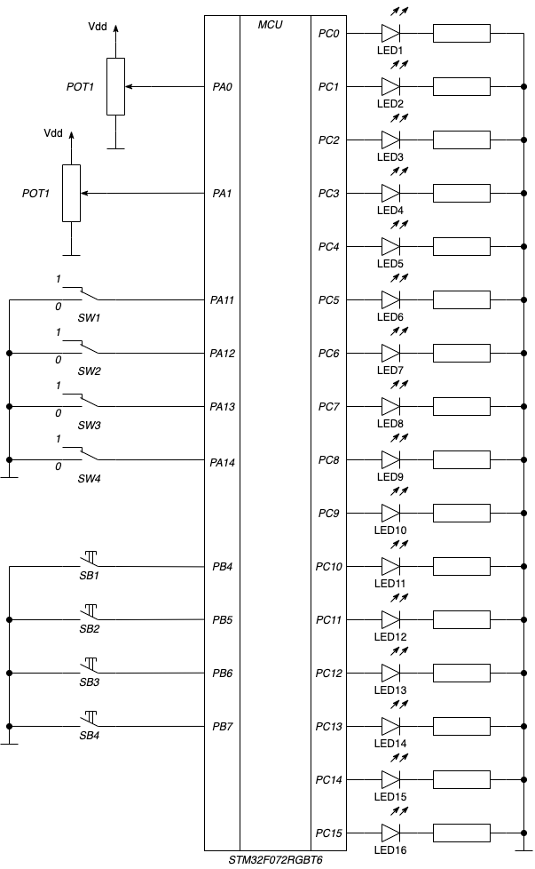

# Практическое занятие №3

## Цель

Целями практического занятия являются:
* изучение способов обработки прерываний
* внешние прерывания через порты ввода/вывода
* прерывания по события АЦП

## Режим _Учебного стенда_ и функциональная схема

Для выполнения задач переключатели _S1_ и _S2_ должны быть установлены в положение _0_ на учебном стенде.
При этом должен загореться светодиод LED1 _While LED_, обозначающий режим стенда номер _0_.

## Описание задач

На практическом занятие решаются две задачи:

* `gpio_interrupt` - _Внешние прерывания на портах ввода/вывода_
* `adc_interrupt` - _Прерывание по окончанию преобразования АЦП_
