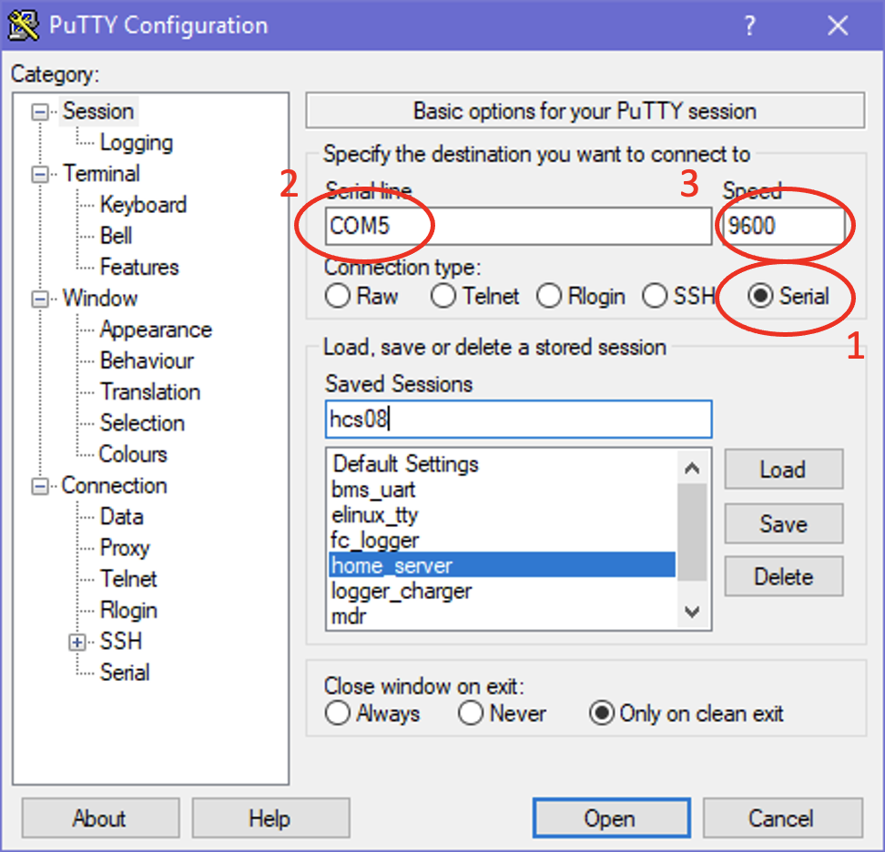
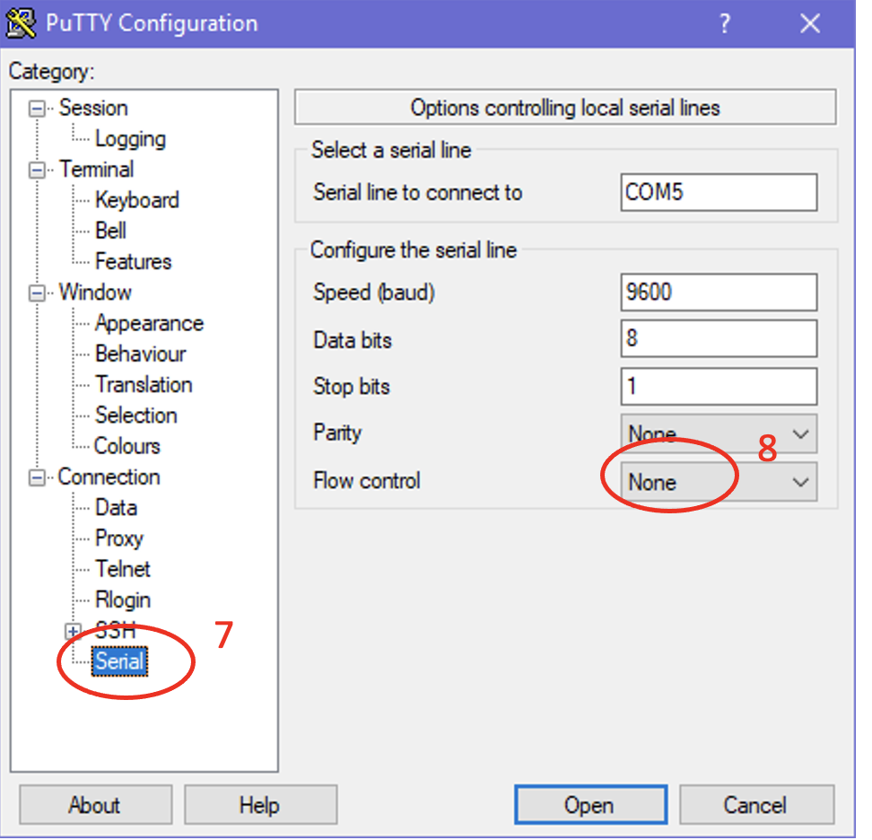

# Лабораторная работа №4

## Цель

В данной лабораторной работе будет изучен контроллер последовательного асинхронного интерфейса UART
(Universal Asynchronous Receiver Transmitter).

## Подготовка к работе

При подготовке к данной работе необходимо изучить основы программирования на языке C,
научится компилировать и загружать программу, изучить регистры специальных функций портов
ввода/вывода общего назначения, модуля таймера _USART_, а также познакомиться кодами _ASCII_.

## Режим _Учебного стенда_ и функциональная схема

Для выполнения данной лабораторной работы следует установить переключатель _S1_ в положение _0_ и _S2_ - в положение _1_ на учебном стенде.
При этом должен загореться светодиод LED1 _RGB LED_, обозначающий режим стенда номер _1_.
Переключатели _S3_ и _S4_ также должны быть установлены в положении _0_.

В этом режиме к выводам микроконтроллера _PA0_, _PA1_ подключены два потенциометра _POT1_ и _POT2_.
Выводы микроконтроллера _PA11-PA14_ подключены к переключателям _SW1-SW4_.
Выводы микроконтроллера _PB4-PB7_ подключены к тактовым кнопкам _SB1-SB4_.
К выводам _PC0-PC15_ подключены 16 светодиодов _D1-D16_.
К выводам _PA6, PA7, PA8_ подключены транзисторы выбора цвета.

К выводам _PA2_ и _PA3_ подключен преобразователь интерфейса _USB-UART_.

**Обратите внимание, что выводы _PA13_ и _PA4_ после сброса используются как линии интерфейса отладки _SWD_.**
Вывод _PA13_ после сброса находится в режиме альтернативной функции _SWDIO_ с включенной подтяжкой к питанию.
Вывод _PA14_ - в режиме альтернативной функции _SWCLK_ с включенной подтяжкой к земле.
Альтернативные функции и подтяжки можно отключить в регистрах управления порта и
задействовать как линии порта _PA13_ и _PA14_, но при этом не будет доступен режим отладки,
а только режим программирования.

В этом варианте к выводам микроконтроллера _PA2_ и _PA3_ подключен преобразователь _RS-232-USB_. Выход этого преобразователя выведен на разъем _X6_ (_USB_) учебного стенда. Разъем _X6_ - это стандартный разъем _USB-B_ с помощью которого можно подключить учебный стенд к персональному компьютеру. Учебный стенд, а точнее преобразователь _UART-USB_, определяется операционной системой как виртуальный _COM_-порт (_Virtual COM_).

## Подготовка лабораторного стенда

Перед работой необходимо подключить лабораторный стенд к персональному компьютеру.
Для считывания поступающих данных на _COM_ порт используется программа эмулятор терминала _PuTTY_.

Параметры программы _PuTTY_ для обмена данными с МК по виртуальному COM порту уже настроены в сессии под названием _learning_stand_.
Запустить сессию можно двойным щелчком на строку _learning_stand_.

Если по каким-либо причинам не удается соединиться с МК, то следует настроить сессию самостоятельно.

Настройка сессии в программе _PuTTY_:

1. Выбрать вид соединения _Serial port_
2. Установить номер порта в поле _Serial line_. Определить номер порта можно в диспетчере устройств. Он может быть указан как Последовательный интерфейс (_COMx_), где x номер интерфейса.
3. Установить скорость обмена в поле _Speed_ равной _9600_
4. Перейти на вкладку _Terminal_
5. Установить параметр _Local echo_ и _Local line edition_ в _Force off_
6. Установить флажок напротив _Implicit LF in every CR_
7. Перейти на вкладку _Serial_
8. Установить _Flow control_ в _None_
9. Вернуться на вкладку _Session_
10. Сохранить параметры сессии задав имя сессии (например, _learning_stand_) в поле _Saved Sessions_ и нажать кнопку _Save_
11. Нажать кнопку _Open_

> :bulb: **Примечание:**  В дальнейшем следует подключаться, нажимая двойным щелчком на имя сессии _learning_stand_.

