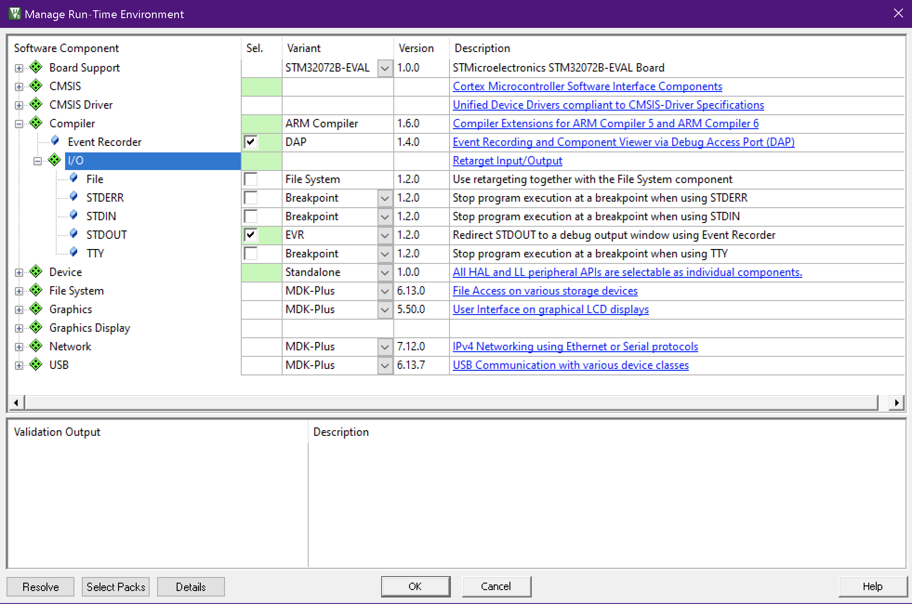
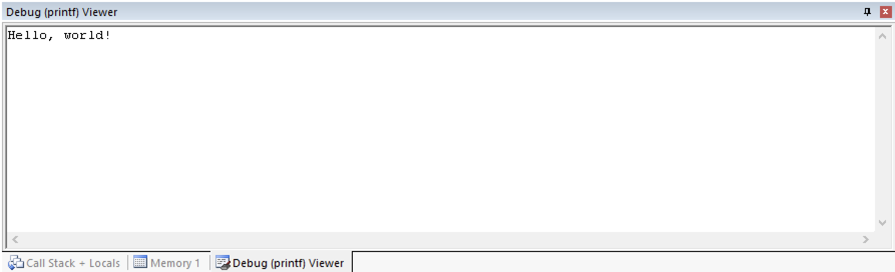

# Практическое занятие №1

## Цель

Целью практического занятия является знакомство с языком программирования C.

## Режим _Учебного стенда_ и функциональная схема

Примеры могут выполненены на симуляторе или на _Учебном стенде_.

## Описание задач

На практическом занятие решаются четыре задачи:

* `c_lang_base` - _Основы языка программирования C_.
    Простейшая программа с основами синтаксиса.
* `c_lang_func` - _Функции в языке программирования C_.
    Использование функций (подпрограмм) в языке C.
* `c_lang_ptr` -  _Указатели в языке программирования C_.
    Использование указателей (адресов) в языке C.
* `c_lang_str` - _Строки в языке программирования C_.
    Использование строк и потока вывода в языке C.

## Перенаправление потока вывода `stdout` в окно отладки

Менеджер пакетов `Run-Time Environment` среды разработки имеет модуль `Event Recorder`,
который позволяет печатать строки в окне `Debug (printf) Viewer` отладчика с помощью
функции `printf`.

Для этого в менеджере пакетов `Manage Run-Time Environment` необходимо выбрать компонент
`Event Recorder` и выбрать перенаправление `stdout` на `EVR`.



В исходном коде программы необходимо подключить модуль `EventRecorder.h` и провести его инициализацию вызвав функцию `EventRecorderInitialize(EventRecordAll, 1);`.

После этого можно использовать функцию `printf` из стандартной библиотеки `stdio.h`.

```c
#include "stdio.h"
#include "EventRecorder.h"

int main(void)
{
    EventRecorderInitialize(EventRecordAll, 1);

    printf("Hello, world!\n");

    for(;;);
}
```

Для просмотра вывода неоходимо открыть окно `Debug (printf) Viewer` в отладчике, выбрав `View - Serial Windows - Debug (printf) Viewer`.

Вывод `printf`:


