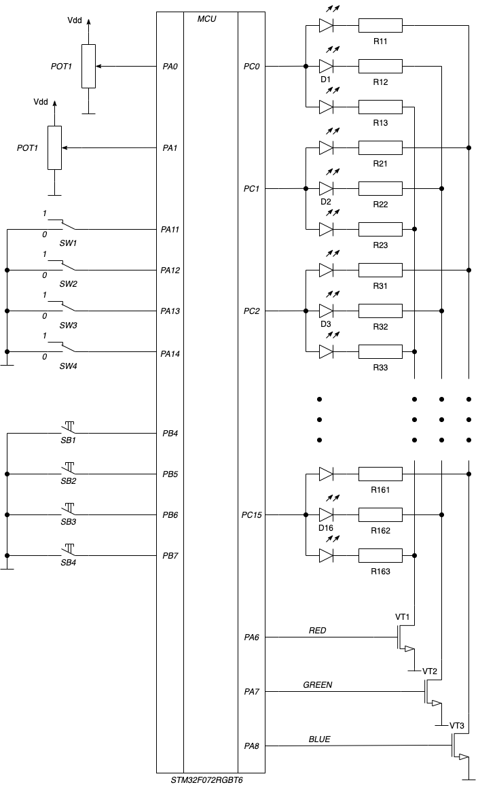

# Практическое занятие №6

## Цель

Целями практического занятия являются:

* изучение таймера-счетчика
* изучение каналов выходного сравнения
* применение таймера-счечика для управления светодиодами

## Режим _Учебного стенда_ и функциональная схема

Для выполнения данной лабораторной работы следует установить переключатель _S1_ в положение _0_ и _S2_ - в положение _1_ на учебном стенде.
При этом должен загореться светодиод LED1 _RGB LED_, обозначающий режим стенда номер _1_.
Переключатели _S3_ и _S4_ также должны быть установлены в положении _0_.

**Обратите внимание, что выводы _PA13_ и _PA4_ после сброса используются как линии интерфейса отладки _SWD_.**
Вывод _PA13_ после сброса находится в режиме альтернативной функции _SWDIO_ с включенной подтяжкой к питанию.
Вывод _PA14_ - в режиме альтернативной функции _SWCLK_ с включенной подтяжкой к земле.
Альтернативные функции и подтяжки можно отключить в регистрах управления порта и
задействовать как линии порта _PA13_ и _PA14_, но при этом не будет доступен режим отладки,
а только режим программирования.
