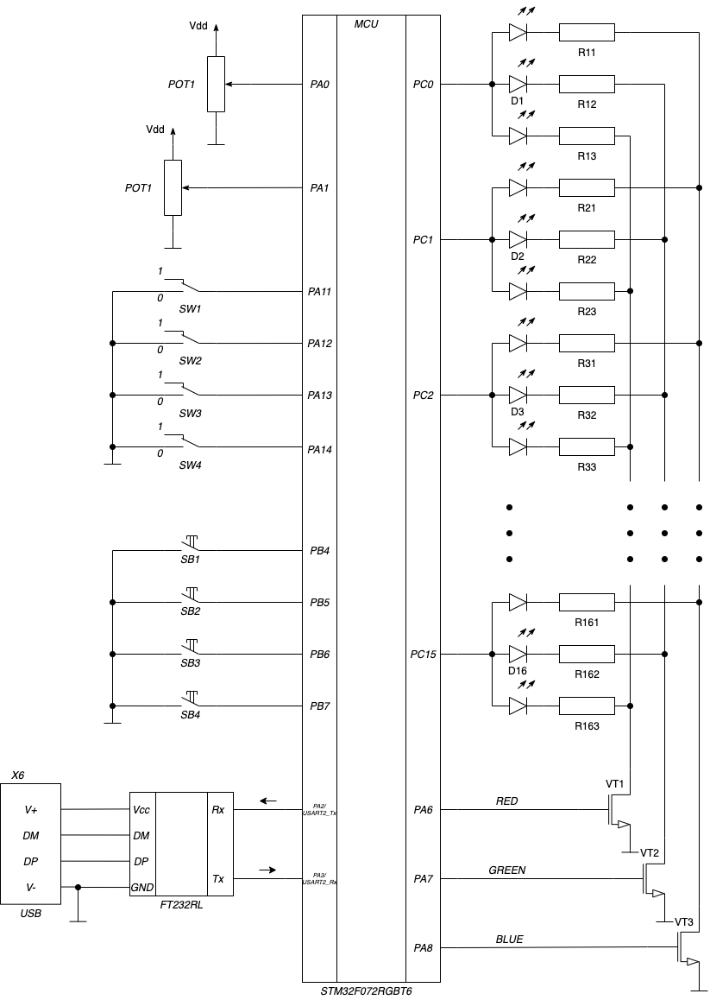

# Практическое занятие №7

## Цель

Целями практического занятия являются:

* изучение последовательного ввода/вывода через UART
* изучение способов обмена текстовой информации

## Режим _Учебного стенда_ и функциональная схема

Для выполнения задачи переключатели _S1_ и _S2_ должны быть установлены в положение _0_ на учебном стенде.
При этом должен загореться светодиод LED1 _While LED_, обозначающий режим стенда номер _0_.
Переключатели _S3_ и _S4_ также должны быть установлены в положении _0_.

**Обратите внимание, что выводы _PA13_ и _PA4_ после сброса используются как линии интерфейса отладки _SWD_.**
Вывод _PA13_ после сброса находится в режиме альтернативной функции _SWDIO_ с включенной подтяжкой к питанию.
Вывод _PA14_ - в режиме альтернативной функции _SWCLK_ с включенной подтяжкой к земле.
Альтернативные функции и подтяжки можно отключить в регистрах управления порта и
задействовать как линии порта _PA13_ и _PA14_, но при этом не будет доступен режим отладки,
а только режим программирования.
